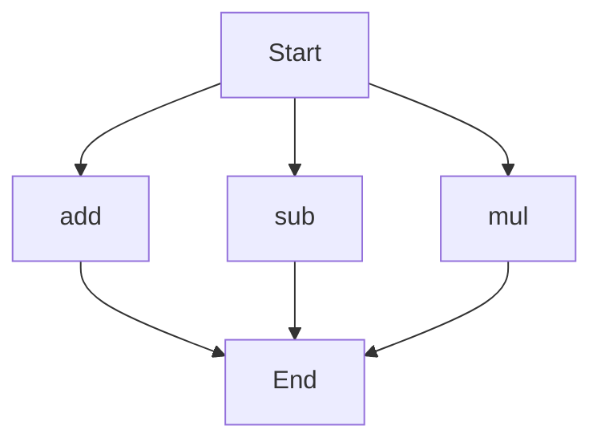

# API Documentation

## calculator.py
### Overview
The `calculator.py` file contains a collection of mathematical functions for basic arithmetic operations.

### Functions
#### add(a, b)
##### Description
The `add` function calculates the sum of two numbers.
##### Parameters
* `a` (int or float): The first number to be added.
* `b` (int or float): The second number to be added.
##### Returns
* The sum of `a` and `b` (int or float).
##### Example
```python
result = add(5, 7)
print(result)  # Output: 12
```

#### sub(c, d)
##### Description
The `sub` function calculates the difference between two numbers.
##### Parameters
* `c` (int or float): The first number.
* `d` (int or float): The second number to be subtracted.
##### Returns
* The difference between `c` and `d` (int or float).
##### Example
```python
result = sub(10, 4)
print(result)  # Output: 6
```

#### mul(a, b)
##### Description
The `mul` function calculates the product of two numbers.
##### Parameters
* `a` (int or float): The first number to be multiplied.
* `b` (int or float): The second number to be multiplied.
##### Returns
* The product of `a` and `b` (int or float).
##### Example
```python
result = mul(3, 9)
print(result)  # Output: 27
```

### Execution Flow
Since there are multiple functions in this file, the execution flow can be visualized as follows:

```mermaid
flowchart TD
    A[Start] --> B[add]
    A --> C[sub]
    A --> D[mul]
    B --> E[End]
    C --> E
    D --> E
```
Note: The execution flow assumes that the functions are called independently, and there is no specific order of execution.

### Module-Level Code
When run directly, this script does not have any module-level code that executes. It is intended to be imported as a module and used by other scripts.