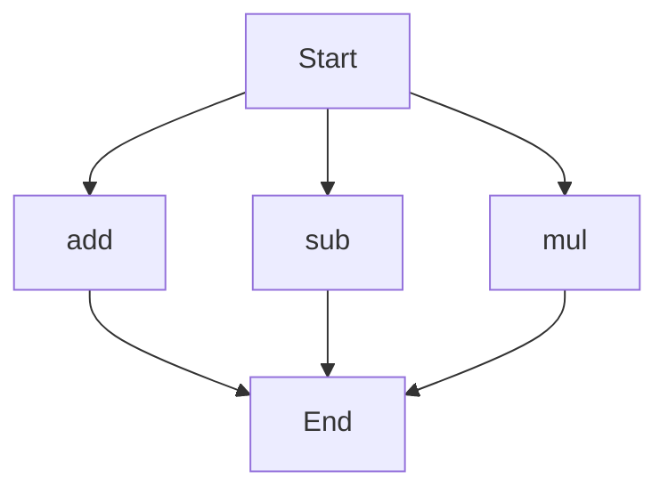

# API Documentation

## calculator.py
The `calculator.py` file provides basic arithmetic operations.

### Functions
#### add(a, b)
##### Description
The `add` function calculates the sum of two numbers.
##### Parameters
* `a` (int or float): The first number to add.
* `b` (int or float): The second number to add.
##### Returns
The sum of `a` and `b`.
##### Example
```python
result = add(5, 7)
print(result)  # Output: 12
```

#### sub(c, d)
##### Description
The `sub` function calculates the difference between two numbers.
##### Parameters
* `c` (int or float): The first number.
* `d` (int or float): The second number to subtract from the first.
##### Returns
The difference between `c` and `d`.
##### Example
```python
result = sub(10, 4)
print(result)  # Output: 6
```

#### mul(a, b)
##### Description
The `mul` function calculates the product of two numbers.
##### Parameters
* `a` (int or float): The first number to multiply.
* `b` (int or float): The second number to multiply.
##### Returns
The product of `a` and `b`.
##### Example
```python
result = mul(3, 9)
print(result)  # Output: 27
```

### Execution Flow
Since there are multiple functions in the `calculator.py` file, the execution flow can be represented as follows:

```mermaid
flowchart TD
    A[Start] --> B[add]
    A --> C[sub]
    A --> D[mul]
    B --> E[End]
    C --> E
    D --> E
```
This flowchart illustrates that the script can start with any of the three functions (`add`, `sub`, or `mul`) and will end after the execution of the chosen function. 

Note: This flowchart assumes that the functions are being called independently. If the functions are being called in a specific order or as part of a larger process, the flowchart would need to be adjusted accordingly. 

There are no classes or variables to document in this file. 

When run directly, this script does not have a main block or any module-level code that would execute, so there is no additional description needed.