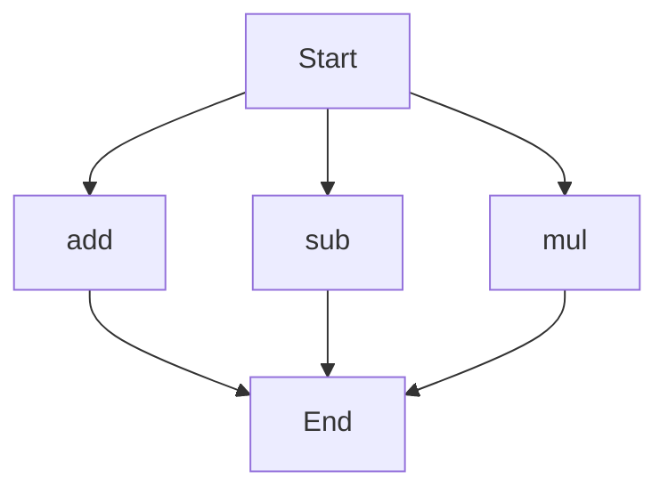

# API Documentation

## calculator.py
### Overview
The calculator.py file contains a collection of mathematical functions. When run directly, this script does not execute any specific task as it only comprises function definitions.

### Functions
#### add(a, b)
##### Description
The `add` function calculates the sum of two numbers.
##### Parameters
* `a` (int or float): The first number to be added.
* `b` (int or float): The second number to be added.
##### Returns
The sum of `a` and `b`.
##### Example
```python
result = add(5, 7)
print(result)  # Outputs: 12
```

#### sub(c, d)
##### Description
The `sub` function calculates the difference between two numbers.
##### Parameters
* `c` (int or float): The first number.
* `d` (int or float): The second number to be subtracted from the first.
##### Returns
The difference between `c` and `d`.
##### Example
```python
result = sub(10, 4)
print(result)  # Outputs: 6
```

#### mul(a, b)
##### Description
The `mul` function calculates the product of two numbers.
##### Parameters
* `a` (int or float): The first number to be multiplied.
* `b` (int or float): The second number to be multiplied.
##### Returns
The product of `a` and `b`.
##### Example
```python
result = mul(5, 6)
print(result)  # Outputs: 30
```

### Execution Flow
Since there are multiple functions in this file, the following flowchart illustrates a possible execution sequence. Note that the actual flow may vary depending on how these functions are called and used in a larger program.

```mermaid
flowchart TD
    A[Start] --> B[add]
    A --> C[sub]
    A --> D[mul]
    B --> E[End]
    C --> E
    D --> E
```
This flowchart shows that the execution can start with any of the `add`, `sub`, or `mul` functions and ends after any one of them is completed. In a real-world application, these functions would likely be called conditionally based on user input or other program logic.