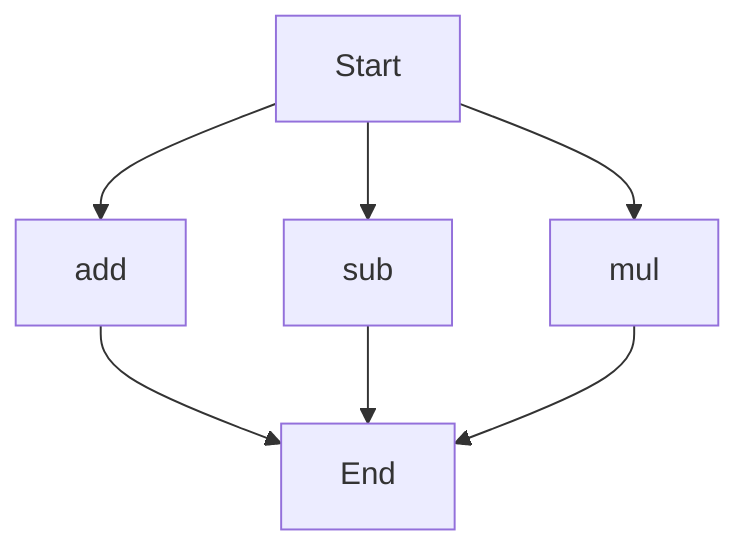

# API Documentation
## calculator.py
The calculator.py file contains a set of mathematical functions for basic arithmetic operations. 

### add(a, b)
#### Description
The `add` function takes two numbers as input and returns their sum. It performs a basic addition operation.

#### Parameters
* `a` (number): The first number to be added.
* `b` (number): The second number to be added.

#### Returns
* The sum of `a` and `b`.

#### Example
```python
result = add(5, 7)
print(result)  # Outputs: 12
```

### sub(c, d)
#### Description
The `sub` function takes two numbers as input and returns their difference. It performs a basic subtraction operation.

#### Parameters
* `c` (number): The first number.
* `d` (number): The second number to be subtracted from the first.

#### Returns
* The difference between `c` and `d`.

#### Example
```python
result = sub(10, 4)
print(result)  # Outputs: 6
```

### mul(a, b)
#### Description
The `mul` function takes two numbers as input and returns their product. It performs a basic multiplication operation.

#### Parameters
* `a` (number): The first number to be multiplied.
* `b` (number): The second number to be multiplied.

#### Returns
* The product of `a` and `b`.

#### Example
```python
result = mul(5, 6)
print(result)  # Outputs: 30
```

Since the calculator.py file has more than one function, the following flowchart illustrates the execution flow of these functions:

```mermaid
flowchart TD
    A[Start] --> B[add]
    A --> C[sub]
    A --> D[mul]
    B --> E[End]
    C --> E
    D --> E
```
Note: The flowchart shows that the execution can start with any of the functions (`add`, `sub`, `mul`) and end after the function call is completed. 

When run directly, the calculator.py script does not have any specific main block or print statements beyond the function definitions provided. It is intended for import and usage of its functions in other Python scripts.