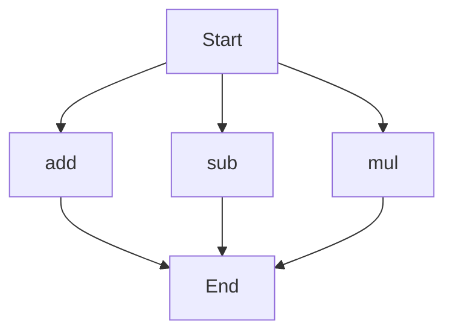

# API Documentation

## calculator.py
This module provides basic arithmetic operations.

### Functions
#### add(a, b)
##### Description
The `add` function takes two numbers as input and returns their sum.

##### Parameters
* `a` (number): The first number to add.
* `b` (number): The second number to add.

##### Returns
* `number`: The sum of `a` and `b`.

##### Example
```python
result = add(5, 3)
print(result)  # Outputs: 8
```

#### sub(c, d)
##### Description
The `sub` function takes two numbers as input and returns their difference.

##### Parameters
* `c` (number): The first number.
* `d` (number): The second number to subtract from the first.

##### Returns
* `number`: The difference between `c` and `d`.

##### Example
```python
result = sub(10, 4)
print(result)  # Outputs: 6
```

#### mul(a, b)
##### Description
The `mul` function takes two numbers as input and returns their product.

##### Parameters
* `a` (number): The first number to multiply.
* `b` (number): The second number to multiply.

##### Returns
* `number`: The product of `a` and `b`.

##### Example
```python
result = mul(7, 2)
print(result)  # Outputs: 14
```

### Execution Flow
Since this module has more than one function, the following flowchart illustrates the execution flow:

```mermaid
flowchart TD
    A[Start] --> B[add]
    A --> C[sub]
    A --> D[mul]
    B --> E[End]
    C --> E
    D --> E
```
Note: The execution flow is straightforward, with each function being called independently. The flowchart shows the possible entry points for each function. 

When run directly, this script does not have any module-level code (e.g., print statements or main blocks) that would execute. It is intended to be imported as a module in other scripts to utilize its functions.