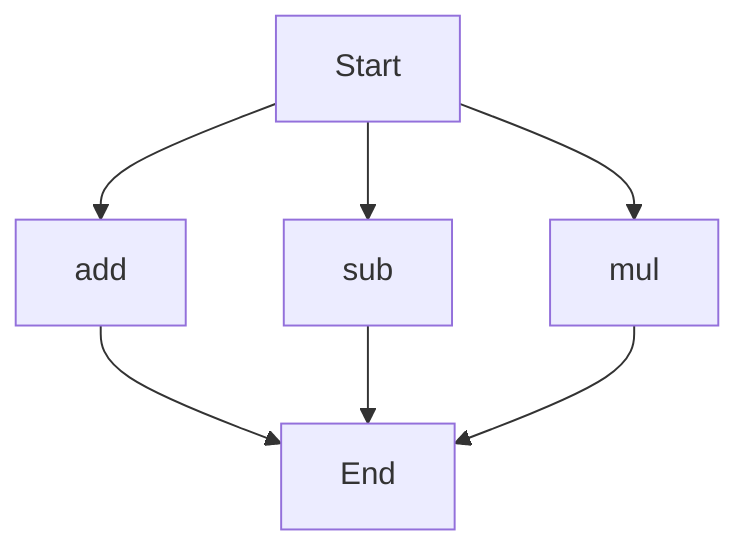

# API Documentation

## calculator.py
### Overview
This script contains a set of basic arithmetic functions.

### Functions

#### add(a, b)
##### Description
The `add` function calculates the sum of two numbers.
##### Parameters
* `a` (number): The first number to add.
* `b` (number): The second number to add.
##### Returns
The sum of `a` and `b`.
##### Example
```python
result = add(5, 3)
print(result)  # Outputs: 8
```

#### sub(c, d)
##### Description
The `sub` function calculates the difference of two numbers.
##### Parameters
* `c` (number): The first number.
* `d` (number): The second number to subtract.
##### Returns
The difference of `c` and `d`.
##### Example
```python
result = sub(10, 4)
print(result)  # Outputs: 6
```

#### mul(a, b)
##### Description
The `mul` function calculates the product of two numbers.
##### Parameters
* `a` (number): The first number to multiply.
* `b` (number): The second number to multiply.
##### Returns
The product of `a` and `b`.
##### Example
```python
result = mul(5, 3)
print(result)  # Outputs: 15
```

### Execution Flow
Since there are multiple functions in this script, the execution flow can be represented as follows:

```mermaid
flowchart TD
    A[Start] --> B[add]
    A --> C[sub]
    A --> D[mul]
    B --> E[End]
    C --> E
    D --> E
```
Note: The execution flow assumes that the functions can be called independently, and the script does not have a main block that controls the flow of execution. 

### Module-Level Code
When run directly, this script does not have any module-level code that executes. It only contains function definitions that can be imported and used by other scripts.