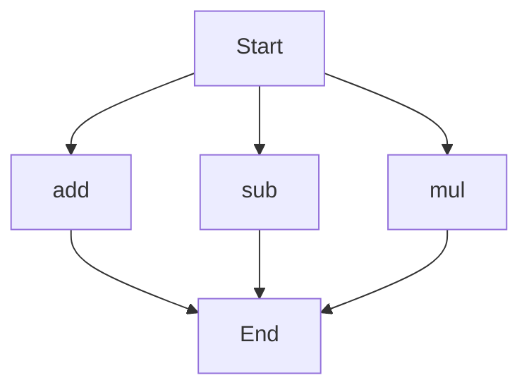

# API Documentation

## calculator.py
This module provides basic arithmetic operations.

### Functions
#### add(a, b)
##### Description
The `add` function calculates the sum of two numbers.
##### Parameters
* `a` (int or float): The first number to add.
* `b` (int or float): The second number to add.
##### Returns
The sum of `a` and `b`.
##### Example
```python
result = add(5, 3)
print(result)  # Output: 8
```

#### sub(c, d)
##### Description
The `sub` function calculates the difference between two numbers.
##### Parameters
* `c` (int or float): The first number.
* `d` (int or float): The second number to subtract from the first.
##### Returns
The difference between `c` and `d`.
##### Example
```python
result = sub(10, 4)
print(result)  # Output: 6
```

#### mul(a, b)
##### Description
The `mul` function calculates the product of two numbers.
##### Parameters
* `a` (int or float): The first number to multiply.
* `b` (int or float): The second number to multiply.
##### Returns
The product of `a` and `b`.
##### Example
```python
result = mul(5, 6)
print(result)  # Output: 30
```

### Execution Flow
Since this module has multiple functions, the execution flow can be represented as follows:

```mermaid
   flowchart TD
       A[Start] --> B[add]
       A --> C[sub]
       A --> D[mul]
       B --> E[End]
       C --> E
       D --> E
```
This flowchart illustrates the possible execution paths for the functions in this module. Note that the actual flow depends on how the functions are called and used in the program. 

When run directly, this script does not have a main block or any module-level code that executes, so there is no specific description for that case.