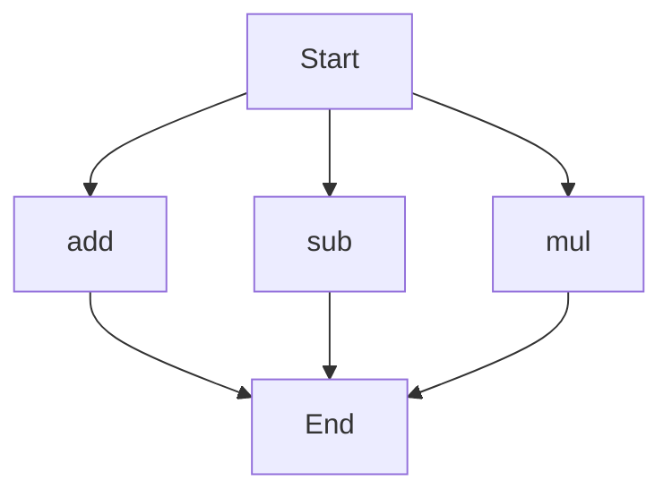

# API Documentation
## calculator.py
The calculator.py file contains a set of mathematical functions that can be used to perform basic arithmetic operations.

### add(a, b)
#### Description
The `add` function calculates the sum of two numbers.
#### Parameters
* `a` (int or float): The first number to be added.
* `b` (int or float): The second number to be added.
#### Returns
The sum of `a` and `b`.
#### Example
```python
result = add(5, 7)
print(result)  # Output: 12
```

### sub(c, d)
#### Description
The `sub` function calculates the difference between two numbers.
#### Parameters
* `c` (int or float): The first number.
* `d` (int or float): The second number to be subtracted from the first.
#### Returns
The difference between `c` and `d`.
#### Example
```python
result = sub(10, 4)
print(result)  # Output: 6
```

### mul(a, b)
#### Description
The `mul` function calculates the product of two numbers.
#### Parameters
* `a` (int or float): The first number to be multiplied.
* `b` (int or float): The second number to be multiplied.
#### Returns
The product of `a` and `b`.
#### Example
```python
result = mul(6, 8)
print(result)  # Output: 48
```

Since there are multiple functions in this file, the execution flow can be represented as follows:

```mermaid
flowchart TD
    A[Start] --> B[add]
    A --> C[sub]
    A --> D[mul]
    B --> E[End]
    C --> E
    D --> E
```
Note: This flowchart shows the possible execution paths for each function. In a real-world application, the actual execution flow would depend on how these functions are called and used. 

When run directly, this script does not have any specific functionality, as it only contains function definitions. However, these functions can be imported and used in other scripts to perform mathematical operations.