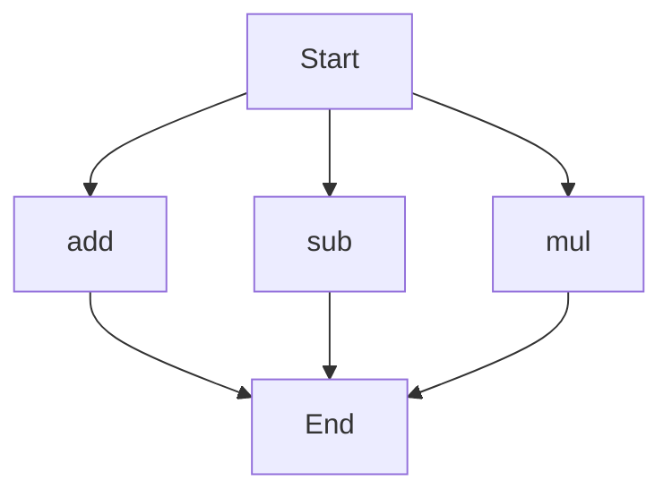

# API Documentation
## calculator.py
The calculator.py file contains a set of basic arithmetic functions.

### add(a, b)
#### Description
The `add` function calculates the sum of two numbers.
#### Parameters
* `a` (int or float): The first number to add.
* `b` (int or float): The second number to add.
#### Returns
The sum of `a` and `b`.
#### Example
```python
result = add(5, 7)
print(result)  # Outputs: 12
```

### sub(c, d)
#### Description
The `sub` function calculates the difference of two numbers.
#### Parameters
* `c` (int or float): The first number.
* `d` (int or float): The second number to subtract.
#### Returns
The difference of `c` and `d`.
#### Example
```python
result = sub(10, 4)
print(result)  # Outputs: 6
```

### mul(a, b)
#### Description
The `mul` function calculates the product of two numbers.
#### Parameters
* `a` (int or float): The first number to multiply.
* `b` (int or float): The second number to multiply.
#### Returns
The product of `a` and `b`.
#### Example
```python
result = mul(5, 6)
print(result)  # Outputs: 30
```

Since the calculator.py file has more than one function, the execution flow can be represented as follows:

```mermaid
flowchart TD
    A[Start] --> B[add]
    A --> C[sub]
    A --> D[mul]
    B --> E[End]
    C --> E
    D --> E
```
Note: This flowchart represents the possible execution paths when the calculator.py file is used as a module. The actual execution flow may vary depending on how the functions are called. 

When run directly, the calculator.py script does not have any specific behavior, as it only contains function definitions. To use the functions, you need to import the calculator module in another Python script and call the functions accordingly.