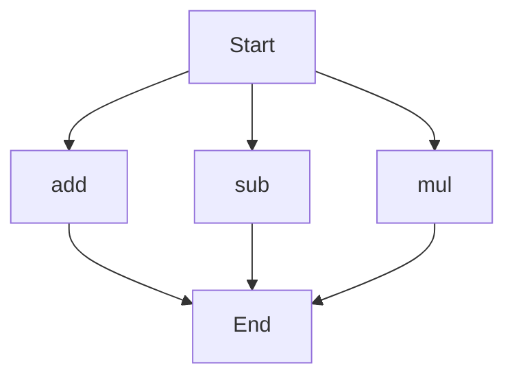

# API Documentation

## calculator.py
The calculator.py file contains a set of basic arithmetic functions.

### add(a, b)
#### Description
The `add` function calculates the sum of two numbers.

#### Parameters
* `a` (number): The first number to add.
* `b` (number): The second number to add.

#### Returns
The sum of `a` and `b`.

#### Example
```python
result = add(5, 3)
print(result)  # Output: 8
```

### sub(c, d)
#### Description
The `sub` function calculates the difference of two numbers.

#### Parameters
* `c` (number): The first number.
* `d` (number): The second number to subtract from the first.

#### Returns
The difference of `c` and `d`.

#### Example
```python
result = sub(10, 4)
print(result)  # Output: 6
```

### mul(a, b)
#### Description
The `mul` function calculates the product of two numbers.

#### Parameters
* `a` (number): The first number to multiply.
* `b` (number): The second number to multiply.

#### Returns
The product of `a` and `b`.

#### Example
```python
result = mul(4, 5)
print(result)  # Output: 20
```

Since there are multiple functions in this file, the following flowchart illustrates the execution flow:

```mermaid
flowchart TD
    A[Start] --> B[add]
    A --> C[sub]
    A --> D[mul]
    B --> E[End]
    C --> E
    D --> E
```
Note: This flowchart is a simplified representation and does not imply any specific execution order or dependency between the functions.