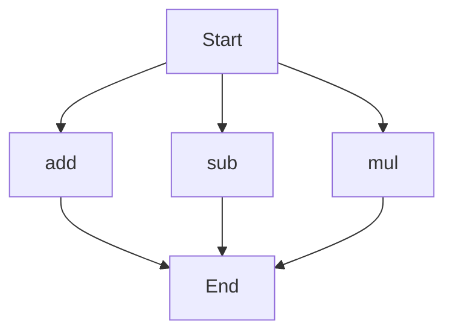

# API Documentation

## calculator.py
### Overview
The `calculator.py` file contains a collection of mathematical functions for basic arithmetic operations.

### Functions
#### add(a, b)
##### Description
The `add` function calculates the sum of two numbers.
##### Parameters
* `a` (int or float): The first number to add.
* `b` (int or float): The second number to add.
##### Returns
* `int` or `float`: The sum of `a` and `b`.
##### Example
```python
result = add(5, 3)
print(result)  # Outputs: 8
```

#### sub(c, d)
##### Description
The `sub` function calculates the difference between two numbers.
##### Parameters
* `c` (int or float): The first number.
* `d` (int or float): The second number to subtract.
##### Returns
* `int` or `float`: The difference between `c` and `d`.
##### Example
```python
result = sub(10, 4)
print(result)  # Outputs: 6
```

#### mul(a, b)
##### Description
The `mul` function calculates the product of two numbers.
##### Parameters
* `a` (int or float): The first number to multiply.
* `b` (int or float): The second number to multiply.
##### Returns
* `int` or `float`: The product of `a` and `b`.
##### Example
```python
result = mul(7, 2)
print(result)  # Outputs: 14
```

### Execution Flow
Since there are multiple functions in this file, the following flowchart illustrates the possible execution flow:

```mermaid
flowchart TD
    A[Start] --> B[add]
    A --> C[sub]
    A --> D[mul]
    B --> E[End]
    C --> E
    D --> E
```
Note: The actual execution flow depends on how the functions are called in the script or by other parts of the program.

### Module-Level Code
When run directly, this script does not have any module-level code that executes. It is designed to be imported and used by other parts of the program.