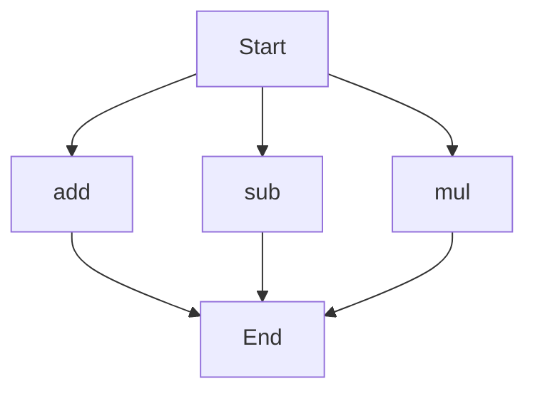

# API Documentation

## calculator.py
### Overview
The calculator.py file contains a set of mathematical functions for basic arithmetic operations.

### Functions

#### add(a, b)
##### Description
The `add` function calculates the sum of two numbers.
##### Parameters
* `a` (int/float): The first number to add.
* `b` (int/float): The second number to add.
##### Returns
The sum of `a` and `b`.
##### Example
```python
result = add(5, 3)
print(result)  # Output: 8
```

#### sub(c, d)
##### Description
The `sub` function calculates the difference of two numbers.
##### Parameters
* `c` (int/float): The first number.
* `d` (int/float): The second number to subtract from the first.
##### Returns
The difference of `c` and `d`.
##### Example
```python
result = sub(10, 4)
print(result)  # Output: 6
```

#### mul(a, b)
##### Description
The `mul` function calculates the product of two numbers.
##### Parameters
* `a` (int/float): The first number to multiply.
* `b` (int/float): The second number to multiply.
##### Returns
The product of `a` and `b`.
##### Example
```python
result = mul(5, 6)
print(result)  # Output: 30
```

### Execution Flow

```mermaid
flowchart TD
    A[Start] --> B[add]
    A --> C[sub]
    A --> D[mul]
    B --> E[End]
    C --> E
    D --> E
```
Note: The execution flow chart shows the possible entry points for the calculator functions. Since these functions are not sequentially dependent, the flowchart represents the individual invocation of each function.