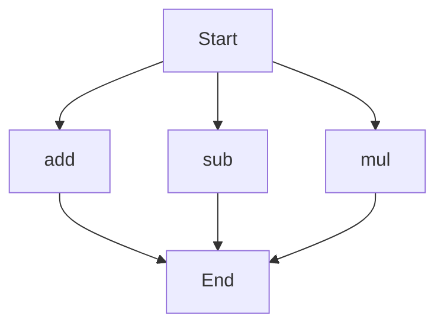

# API Documentation

## calculator.py
The calculator.py file contains a collection of mathematical functions. When run directly, this script does not execute any specific tasks as it only defines functions for later use in other programs.

### Functions
#### add(a, b)
Description: This function calculates the sum of two numbers.
Parameters:
- a (int or float): The first number to add.
- b (int or float): The second number to add.
Returns: The sum of a and b.
Example: 
```python
result = add(5, 7)
print(result)  # Outputs: 12
```

#### sub(c, d)
Description: This function calculates the difference between two numbers.
Parameters:
- c (int or float): The first number.
- d (int or float): The second number to subtract from the first.
Returns: The difference between c and d.
Example: 
```python
result = sub(10, 4)
print(result)  # Outputs: 6
```

#### mul(a, b)
Description: This function calculates the product of two numbers.
Parameters:
- a (int or float): The first number to multiply.
- b (int or float): The second number to multiply.
Returns: The product of a and b.
Example: 
```python
result = mul(5, 6)
print(result)  # Outputs: 30
```

### Execution Flow
Since there are multiple functions in this file, the following Mermaid flowchart illustrates a possible execution flow. Note that the actual flow depends on how these functions are called from other parts of the program.

```mermaid
flowchart TD
    A[Start] --> B[add]
    A --> C[sub]
    A --> D[mul]
    B --> E[End]
    C --> E
    D --> E
```
This flowchart demonstrates how the script might begin and then proceed to call any of the `add`, `sub`, or `mul` functions before ending. The actual sequence of function calls is determined by the external program using these functions.