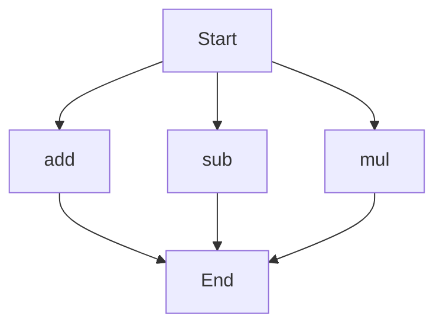

# API Documentation

## calculator.py
The calculator.py file contains a collection of mathematical functions that can be used to perform basic arithmetic operations.

### add(a, b)
#### Description
The `add` function takes two numbers as input and returns their sum.

#### Parameters
* `a` (int/float): The first number to be added.
* `b` (int/float): The second number to be added.

#### Returns
* `int/float`: The sum of `a` and `b`.

#### Example
```python
result = add(5, 3)
print(result)  # Output: 8
```

### sub(c, d)
#### Description
The `sub` function takes two numbers as input and returns their difference.

#### Parameters
* `c` (int/float): The first number.
* `d` (int/float): The second number to be subtracted from the first.

#### Returns
* `int/float`: The difference between `c` and `d`.

#### Example
```python
result = sub(10, 4)
print(result)  # Output: 6
```

### mul(a, b)
#### Description
The `mul` function takes two numbers as input and returns their product.

#### Parameters
* `a` (int/float): The first number to be multiplied.
* `b` (int/float): The second number to be multiplied.

#### Returns
* `int/float`: The product of `a` and `b`.

#### Example
```python
result = mul(7, 2)
print(result)  # Output: 14
```

Since there are multiple functions in this file, here is a flowchart showing the execution flow:

```mermaid
flowchart TD
    A[Start] --> B[add]
    A --> C[sub]
    A --> D[mul]
    B --> E[End]
    C --> E
    D --> E
```
Note: This flowchart assumes that the functions can be called independently, and the execution flow may vary depending on the actual usage of these functions. 

When run directly, this script does not have any specific functionality, as it only contains function definitions. To use these functions, you would need to call them from another script or from an interactive Python environment.