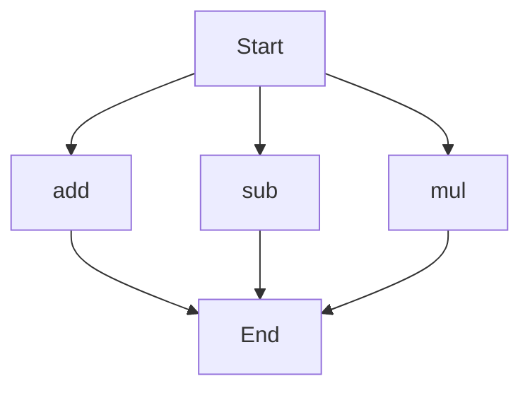

# API Documentation

## calculator.py
The calculator.py file contains a collection of mathematical functions that can be used to perform basic arithmetic operations.

### add(a, b)
#### Description
The `add` function calculates the sum of two numbers.
#### Parameters
* `a` (int or float): The first number to be added.
* `b` (int or float): The second number to be added.
#### Returns
The sum of `a` and `b`.
#### Example
```python
result = add(5, 7)
print(result)  # Output: 12
```

### sub(c, d)
#### Description
The `sub` function calculates the difference of two numbers.
#### Parameters
* `c` (int or float): The first number.
* `d` (int or float): The second number to be subtracted.
#### Returns
The difference of `c` and `d`.
#### Example
```python
result = sub(10, 4)
print(result)  # Output: 6
```

### mul(a, b)
#### Description
The `mul` function calculates the product of two numbers.
#### Parameters
* `a` (int or float): The first number to be multiplied.
* `b` (int or float): The second number to be multiplied.
#### Returns
The product of `a` and `b`.
#### Example
```python
result = mul(6, 9)
print(result)  # Output: 54
```

Since there are multiple functions in this file, the execution flow can be represented as follows:

```mermaid
flowchart TD
    A[Start] --> B[add]
    A --> C[sub]
    A --> D[mul]
    B --> E[End]
    C --> E
    D --> E
```
Note: The execution flow chart shows that the program starts and can execute any of the three functions (`add`, `sub`, `mul`) before ending. 

No module-level code, classes, or variables were found in this file.