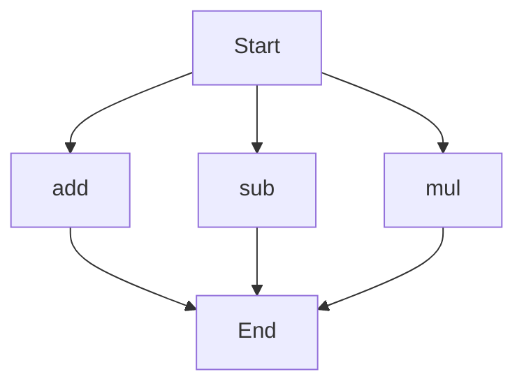

# API Documentation

## calculator.py
The calculator.py file contains a collection of mathematical functions. When run directly, this script does not execute any specific code, as it is designed to be imported and used as a module in other Python programs.

### Functions
#### add(a, b)
##### Description
The `add` function calculates the sum of two numbers.
##### Parameters
* `a` (int/float): The first number to be added.
* `b` (int/float): The second number to be added.
##### Returns
The sum of `a` and `b` (int/float).
##### Example
```python
result = add(5, 7)
print(result)  # Outputs: 12
```

#### sub(c, d)
##### Description
The `sub` function calculates the difference between two numbers.
##### Parameters
* `c` (int/float): The first number.
* `d` (int/float): The second number to be subtracted from the first.
##### Returns
The difference between `c` and `d` (int/float).
##### Example
```python
result = sub(10, 4)
print(result)  # Outputs: 6
```

#### mul(a, b)
##### Description
The `mul` function calculates the product of two numbers.
##### Parameters
* `a` (int/float): The first number to be multiplied.
* `b` (int/float): The second number to be multiplied.
##### Returns
The product of `a` and `b` (int/float).
##### Example
```python
result = mul(6, 9)
print(result)  # Outputs: 54
```

### Execution Flow
Since there are multiple functions in this file, the execution flow can be represented as follows:

```mermaid
flowchart TD
    A[Start] --> B[add]
    A --> C[sub]
    A --> D[mul]
    B --> E[End]
    C --> E
    D --> E
```
This flowchart illustrates that the execution of the script starts at any of the three functions (`add`, `sub`, `mul`), and each function executes independently before reaching the end.