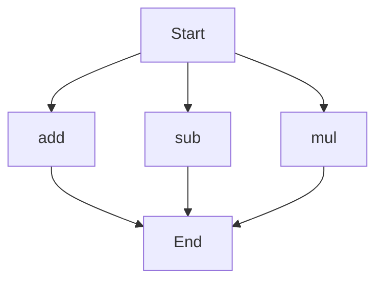

# API Documentation
## calculator.py
The calculator.py file contains a set of basic arithmetic functions.

### add(a, b)
#### Description
The `add` function takes two numbers as input and returns their sum.
#### Parameters
* `a` (int/float): The first number to add.
* `b` (int/float): The second number to add.
#### Returns
* `int/float`: The sum of `a` and `b`.
#### Example
```python
result = add(5, 3)
print(result)  # Outputs: 8
```

### sub(c, d)
#### Description
The `sub` function takes two numbers as input and returns their difference.
#### Parameters
* `c` (int/float): The first number.
* `d` (int/float): The second number to subtract from the first.
#### Returns
* `int/float`: The difference between `c` and `d`.
#### Example
```python
result = sub(10, 4)
print(result)  # Outputs: 6
```

### mul(a, b)
#### Description
The `mul` function takes two numbers as input and returns their product.
#### Parameters
* `a` (int/float): The first number to multiply.
* `b` (int/float): The second number to multiply.
#### Returns
* `int/float`: The product of `a` and `b`.
#### Example
```python
result = mul(7, 2)
print(result)  # Outputs: 14
```

Since the calculator.py file contains more than one function, the execution flow can be represented as follows:

```mermaid
flowchart TD
    A[Start] --> B[add]
    A --> C[sub]
    A --> D[mul]
    B --> E[End]
    C --> E
    D --> E
```
When run directly, this script provides a basic calculator functionality, allowing users to perform addition, subtraction, and multiplication operations.