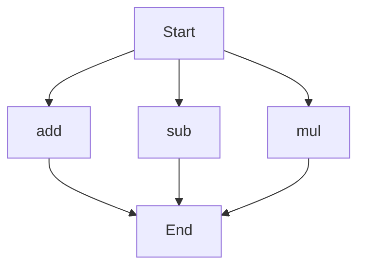

# API Documentation

## calculator.py
This module provides basic arithmetic operations.

### Functions
#### add(a, b)
##### Description
The `add` function calculates the sum of two numbers.

##### Parameters
* `a` (int/float): The first number to add.
* `b` (int/float): The second number to add.

##### Returns
* `int/float`: The sum of `a` and `b`.

##### Example
```python
result = add(5, 3)
print(result)  # Output: 8
```

#### sub(c, d)
##### Description
The `sub` function calculates the difference of two numbers.

##### Parameters
* `c` (int/float): The first number.
* `d` (int/float): The second number to subtract.

##### Returns
* `int/float`: The difference of `c` and `d`.

##### Example
```python
result = sub(10, 4)
print(result)  # Output: 6
```

#### mul(a, b)
##### Description
The `mul` function calculates the product of two numbers.

##### Parameters
* `a` (int/float): The first number to multiply.
* `b` (int/float): The second number to multiply.

##### Returns
* `int/float`: The product of `a` and `b`.

##### Example
```python
result = mul(7, 2)
print(result)  # Output: 14
```

### Execution Flow
Since this module has more than one function, the execution flow can be represented as follows:

```mermaid
flowchart TD
    A[Start] --> B[add]
    A --> C[sub]
    A --> D[mul]
    B --> E[End]
    C --> E
    D --> E
```
Note: The execution flow is not necessarily a linear sequence, as the functions can be called independently.

### Module-Level Code
When run directly, this script does not execute any specific code, as it only defines functions for arithmetic operations. To use these functions, you need to import the module or call the functions directly in a Python script.