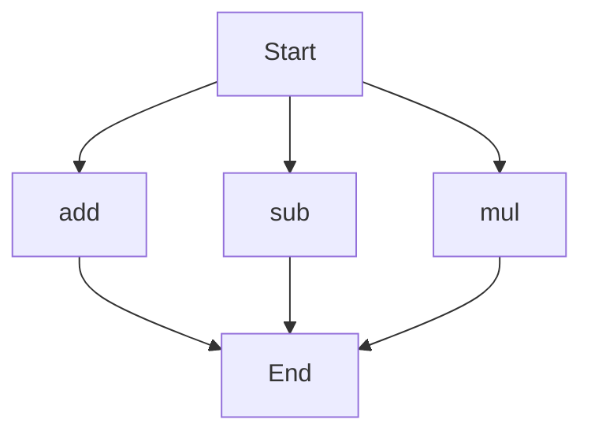

# API Documentation
## calculator.py
The calculator.py file contains a set of basic arithmetic functions.

### Functions
#### add(a, b)
##### Description
The `add` function calculates the sum of two numbers.
##### Parameters
* `a` (int or float): The first number to be added.
* `b` (int or float): The second number to be added.
##### Returns
* The sum of `a` and `b` (int or float).
##### Example
```python
result = add(5, 7)
print(result)  # Output: 12
```

#### sub(c, d)
##### Description
The `sub` function calculates the difference of two numbers.
##### Parameters
* `c` (int or float): The first number.
* `d` (int or float): The second number to be subtracted.
##### Returns
* The difference of `c` and `d` (int or float).
##### Example
```python
result = sub(10, 4)
print(result)  # Output: 6
```

#### mul(a, b)
##### Description
The `mul` function calculates the product of two numbers.
##### Parameters
* `a` (int or float): The first number to be multiplied.
* `b` (int or float): The second number to be multiplied.
##### Returns
* The product of `a` and `b` (int or float).
##### Example
```python
result = mul(6, 8)
print(result)  # Output: 48
```

### Execution Flow
Since there are multiple functions in this file, the following flowchart illustrates the execution flow:

```mermaid
flowchart TD
    A[Start] --> B[add]
    A --> C[sub]
    A --> D[mul]
    B --> E[End]
    C --> E
    D --> E
```
Note that the execution flow may vary depending on how the functions are called and used in the program.

### Module-Level Code
When run directly, this script does not have any specific functionality, as it only contains function definitions. However, you can use the functions provided to perform basic arithmetic operations. For example:
```python
# calculator.py
print(add(5, 7))  # Output: 12
print(sub(10, 4))  # Output: 6
print(mul(6, 8))  # Output: 48
```