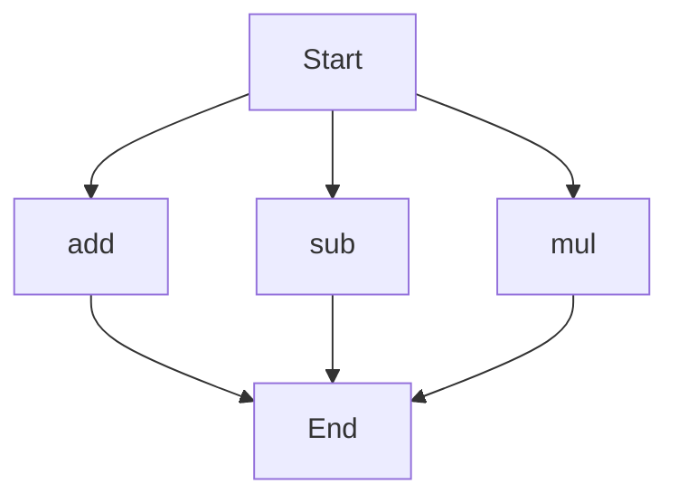

# API Documentation
## calculator.py
### Functions
#### add(a, b)
##### Description
The `add` function calculates the sum of two numbers.

##### Parameters
* `a` (int or float): The first number to add.
* `b` (int or float): The second number to add.

##### Returns
The sum of `a` and `b` as an integer or float.

##### Example
```python
result = add(5, 3)
print(result)  # Outputs: 8
```

#### sub(c, d)
##### Description
The `sub` function calculates the difference between two numbers.

##### Parameters
* `c` (int or float): The first number.
* `d` (int or float): The second number to subtract from the first.

##### Returns
The difference between `c` and `d` as an integer or float.

##### Example
```python
result = sub(10, 4)
print(result)  # Outputs: 6
```

#### mul(a, b)
##### Description
The `mul` function calculates the product of two numbers.

##### Parameters
* `a` (int or float): The first number to multiply.
* `b` (int or float): The second number to multiply.

##### Returns
The product of `a` and `b` as an integer or float.

##### Example
```python
result = mul(7, 2)
print(result)  # Outputs: 14
```

### Execution Flow
Since this file contains more than one function, here is a flowchart showing the execution flow:

```mermaid
flowchart TD
    A[Start] --> B[add]
    A --> C[sub]
    A --> D[mul]
    B --> E[End]
    C --> E
    D --> E
```
Note: This flowchart assumes that each function can be called independently from the start. The actual execution flow may vary depending on how the functions are used in the program. 

No classes or variables are defined in this file. If run directly, the script does not have a main block, so there is no specific behavior when executed as a standalone program.