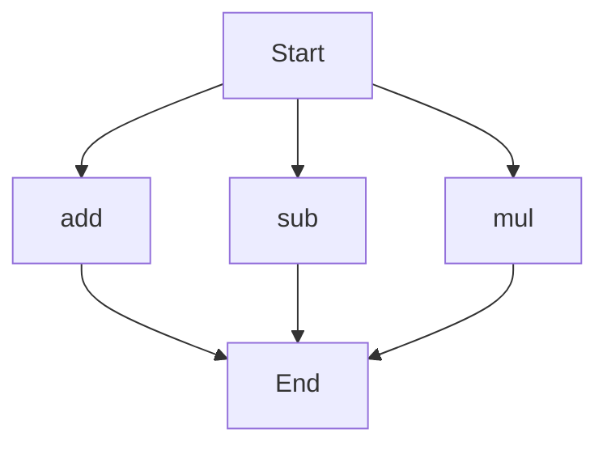

# API Documentation
## calculator.py
The calculator.py file contains a set of basic arithmetic functions. 

### add(a, b)
#### Description
The `add` function calculates the sum of two numbers.
#### Parameters
* `a` (int or float): The first number to add.
* `b` (int or float): The second number to add.
#### Returns
The sum of `a` and `b`.
#### Example
```python
result = add(5, 3)
print(result)  # Output: 8
```

### sub(c, d)
#### Description
The `sub` function calculates the difference between two numbers.
#### Parameters
* `c` (int or float): The first number.
* `d` (int or float): The second number to subtract from the first.
#### Returns
The difference between `c` and `d`.
#### Example
```python
result = sub(10, 4)
print(result)  # Output: 6
```

### mul(a, b)
#### Description
The `mul` function calculates the product of two numbers.
#### Parameters
* `a` (int or float): The first number to multiply.
* `b` (int or float): The second number to multiply.
#### Returns
The product of `a` and `b`.
#### Example
```python
result = mul(7, 2)
print(result)  # Output: 14
```

Since there are multiple functions in this file, the execution flow can be represented as follows:

```mermaid
flowchart TD
    A[Start] --> B[add]
    A --> C[sub]
    A --> D[mul]
    B --> E[End]
    C --> E
    D --> E
```
Note: This flowchart illustrates that the execution can start with any of the three functions, and each function leads to the end of the execution. 

When run directly, this script does not have a main block or any print statements, so it does not perform any actions on its own. It is meant to be imported and used as a module in other scripts.