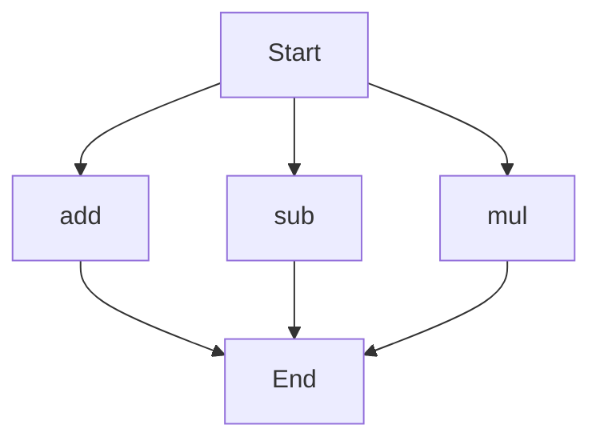

# API Documentation
## calculator.py
The calculator.py file contains a set of functions for basic arithmetic operations.

### add(a, b)
#### Description
The `add` function calculates the sum of two numbers.
#### Parameters
* `a` (int or float): The first number to be added.
* `b` (int or float): The second number to be added.
#### Returns
The sum of `a` and `b`.
#### Example
```python
result = add(5, 3)
print(result)  # Outputs: 8
```

### sub(c, d)
#### Description
The `sub` function calculates the difference of two numbers.
#### Parameters
* `c` (int or float): The first number.
* `d` (int or float): The second number to be subtracted from the first.
#### Returns
The difference of `c` and `d`.
#### Example
```python
result = sub(10, 4)
print(result)  # Outputs: 6
```

### mul(a, b)
#### Description
The `mul` function calculates the product of two numbers.
#### Parameters
* `a` (int or float): The first number to be multiplied.
* `b` (int or float): The second number to be multiplied.
#### Returns
The product of `a` and `b`.
#### Example
```python
result = mul(7, 2)
print(result)  # Outputs: 14
```

Since there are multiple functions in this file, the execution flow can be represented as follows:

```mermaid
   flowchart TD
       A[Start] --> B[add]
       A --> C[sub]
       A --> D[mul]
       B --> E[End]
       C --> E
       D --> E
```
Note: The flowchart depicts the possible execution paths for each function, but does not imply a specific order of operation. The actual execution flow will depend on how these functions are called in the code.