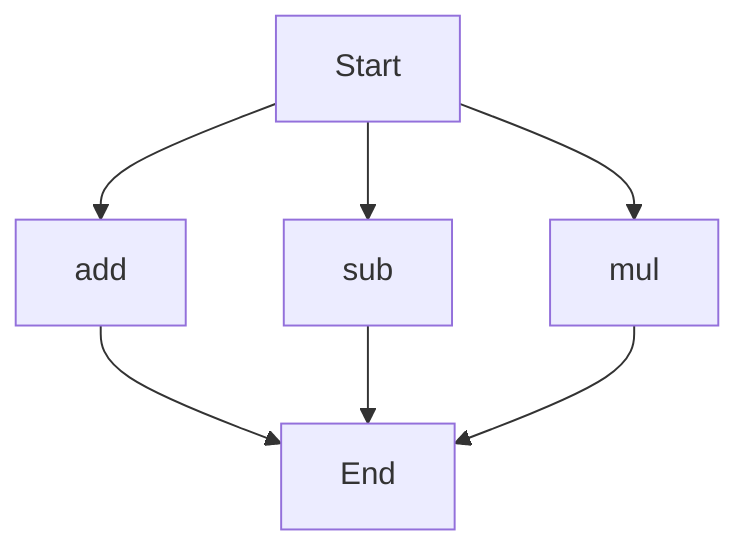

# API Documentation

## calculator.py
The calculator.py file contains a collection of mathematical functions to perform basic arithmetic operations.

### add(a, b)
#### Description
The `add` function calculates the sum of two numbers.

#### Parameters
* `a` (int/float): The first number to be added.
* `b` (int/float): The second number to be added.

#### Returns
* `int/float`: The sum of `a` and `b`.

#### Example
```python
result = add(5, 3)
print(result)  # Output: 8
```

### sub(c, d)
#### Description
The `sub` function calculates the difference between two numbers.

#### Parameters
* `c` (int/float): The first number.
* `d` (int/float): The second number to be subtracted.

#### Returns
* `int/float`: The difference between `c` and `d`.

#### Example
```python
result = sub(10, 4)
print(result)  # Output: 6
```

### mul(a, b)
#### Description
The `mul` function calculates the product of two numbers.

#### Parameters
* `a` (int/float): The first number to be multiplied.
* `b` (int/float): The second number to be multiplied.

#### Returns
* `int/float`: The product of `a` and `b`.

#### Example
```python
result = mul(5, 6)
print(result)  # Output: 30
```

Since the calculator.py file contains more than one function, the following flowchart illustrates the execution flow of these functions:

```mermaid
flowchart TD
    A[Start] --> B[add]
    A --> C[sub]
    A --> D[mul]
    B --> E[End]
    C --> E
    D --> E
```

There are no classes, variables, or module-level code in this file. The functions can be used independently to perform the desired mathematical operations.