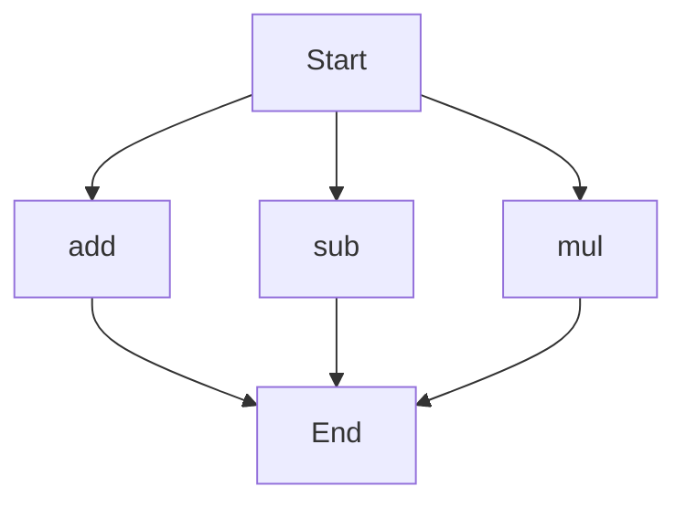

# API Documentation

## calculator.py
The calculator.py file contains a collection of mathematical functions.

### Functions
#### add(a, b)
##### Description
The `add` function calculates the sum of two numbers.

##### Parameters
* `a` (int or float): The first number to add.
* `b` (int or float): The second number to add.

##### Returns
The sum of `a` and `b`.

##### Example
```python
result = add(5, 3)
print(result)  # Output: 8
```

#### sub(c, d)
##### Description
The `sub` function calculates the difference of two numbers.

##### Parameters
* `c` (int or float): The first number.
* `d` (int or float): The second number to subtract.

##### Returns
The difference of `c` and `d`.

##### Example
```python
result = sub(10, 4)
print(result)  # Output: 6
```

#### mul(a, b)
##### Description
The `mul` function calculates the product of two numbers.

##### Parameters
* `a` (int or float): The first number to multiply.
* `b` (int or float): The second number to multiply.

##### Returns
The product of `a` and `b`.

##### Example
```python
result = mul(4, 5)
print(result)  # Output: 20
```

### Module-Level Code
The calculator.py script does not contain any module-level code.

### Execution Flow

```mermaid
flowchart TD
    A[Start] --> B[add]
    A --> C[sub]
    A --> D[mul]
    B --> E[End]
    C --> E
    D --> E
```
This flowchart illustrates the possible execution paths of the calculator.py script. The `add`, `sub`, and `mul` functions can be called independently, and the script does not have a linear execution flow.