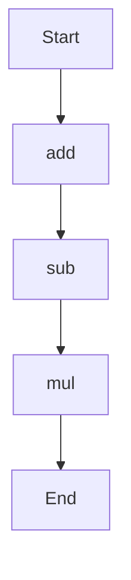

# API Documentation
## calculator.py
The calculator.py file contains a set of functions for basic arithmetic operations.

### add(a, b)
#### Description
The `add` function calculates the sum of two numbers.

#### Parameters
* `a` (int/float): The first number to be added.
* `b` (int/float): The second number to be added.

#### Returns
* `int/float`: The sum of `a` and `b`.

#### Example
```python
result = add(5, 7)
print(result)  # Output: 12
```

### sub(c, d)
#### Description
The `sub` function calculates the difference between two numbers.

#### Parameters
* `c` (int/float): The first number.
* `d` (int/float): The second number to be subtracted.

#### Returns
* `int/float`: The difference between `c` and `d`.

#### Example
```python
result = sub(10, 4)
print(result)  # Output: 6
```

### mul(a, b)
#### Description
The `mul` function calculates the product of two numbers.

#### Parameters
* `a` (int/float): The first number to be multiplied.
* `b` (int/float): The second number to be multiplied.

#### Returns
* `int/float`: The product of `a` and `b`.

#### Example
```python
result = mul(6, 9)
print(result)  # Output: 54
```

Since the calculator.py file has more than one function, the following flowchart illustrates the execution flow:

```mermaid
flowchart TD
    A[Start] --> B[add]
    B --> C[sub]
    C --> D[mul]
    D --> E[End]
```
Note: The flowchart represents a possible sequence of function calls, but the actual execution flow may vary depending on the specific use case. 

The calculator.py file does not contain any classes or variables. When run directly, this script does not have a main block or any module-level code that performs a specific task.