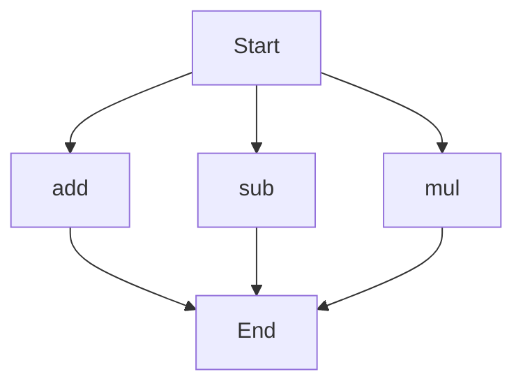

# API Documentation

## calculator.py
The calculator.py file contains a set of mathematical functions to perform basic arithmetic operations.

### add(a, b)
#### Description
The `add` function takes two numbers as input and returns their sum.

#### Parameters
* `a` (int or float): The first number to add.
* `b` (int or float): The second number to add.

#### Returns
* `int` or `float`: The sum of `a` and `b`.

#### Example
```python
result = add(5, 3)
print(result)  # Outputs: 8
```

### sub(c, d)
#### Description
The `sub` function takes two numbers as input and returns their difference.

#### Parameters
* `c` (int or float): The first number.
* `d` (int or float): The second number to subtract from the first.

#### Returns
* `int` or `float`: The difference between `c` and `d`.

#### Example
```python
result = sub(10, 4)
print(result)  # Outputs: 6
```

### mul(a, b)
#### Description
The `mul` function takes two numbers as input and returns their product.

#### Parameters
* `a` (int or float): The first number to multiply.
* `b` (int or float): The second number to multiply.

#### Returns
* `int` or `float`: The product of `a` and `b`.

#### Example
```python
result = mul(6, 7)
print(result)  # Outputs: 42
```

Since the calculator.py file contains more than one function, here is a Mermaid flowchart showing the execution flow:

```mermaid
   flowchart TD
       A[Start] --> B[add]
       A --> C[sub]
       A --> D[mul]
       B --> E[End]
       C --> E
       D --> E
```
Note: The actual execution flow may vary depending on how these functions are called in the script or other parts of the program. This flowchart is a general representation of the functions' relationships.