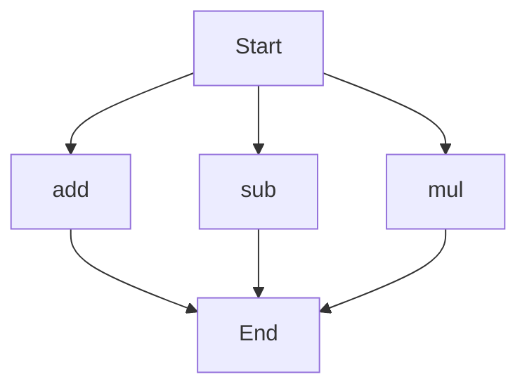

# API Documentation

## calculator.py
The `calculator.py` file contains a collection of basic arithmetic functions.

### add(a, b)
#### Description
The `add` function calculates the sum of two numbers.

#### Parameters
* `a` (int or float): The first number to add.
* `b` (int or float): The second number to add.

#### Returns
The sum of `a` and `b` as an integer or floating-point number.

#### Example
```python
result = add(5, 7)
print(result)  # Output: 12
```

### sub(c, d)
#### Description
The `sub` function calculates the difference between two numbers.

#### Parameters
* `c` (int or float): The first number.
* `d` (int or float): The second number to subtract from the first.

#### Returns
The difference between `c` and `d` as an integer or floating-point number.

#### Example
```python
result = sub(10, 4)
print(result)  # Output: 6
```

### mul(a, b)
#### Description
The `mul` function calculates the product of two numbers.

#### Parameters
* `a` (int or float): The first number to multiply.
* `b` (int or float): The second number to multiply.

#### Returns
The product of `a` and `b` as an integer or floating-point number.

#### Example
```python
result = mul(6, 9)
print(result)  # Output: 54
```

Since `calculator.py` has more than one function, here is a Mermaid flowchart showing the execution flow:

```mermaid
flowchart TD
    A[Start] --> B[add]
    A --> C[sub]
    A --> D[mul]
    B --> E[End]
    C --> E
    D --> E
```

Note: The flowchart is a simplified representation and does not reflect any specific execution order or dependencies between functions. In a real-world scenario, the execution flow may vary depending on how these functions are used within a larger application or script.