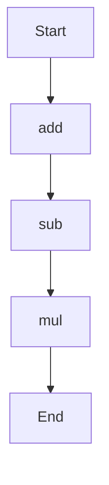

# API Documentation
## calculator.py
The `calculator.py` file contains a set of mathematical functions that can be used to perform basic arithmetic operations.

### add(a, b)
#### Description
The `add` function calculates the sum of two numbers.
#### Parameters
* `a` (int or float): The first number to add.
* `b` (int or float): The second number to add.
#### Returns
* `int` or `float`: The sum of `a` and `b`.
#### Example
```python
result = add(5, 3)
print(result)  # Outputs: 8
```

### sub(c, d)
#### Description
The `sub` function calculates the difference between two numbers.
#### Parameters
* `c` (int or float): The first number.
* `d` (int or float): The second number to subtract from the first.
#### Returns
* `int` or `float`: The difference between `c` and `d`.
#### Example
```python
result = sub(10, 4)
print(result)  # Outputs: 6
```

### mul(a, b)
#### Description
The `mul` function calculates the product of two numbers.
#### Parameters
* `a` (int or float): The first number to multiply.
* `b` (int or float): The second number to multiply.
#### Returns
* `int` or `float`: The product of `a` and `b`.
#### Example
```python
result = mul(5, 6)
print(result)  # Outputs: 30
```

Since the `calculator.py` file has more than one function, the following flowchart illustrates the execution flow:

```mermaid
flowchart TD
    A[Start] --> B[add]
    B --> C[sub]
    C --> D[mul]
    D --> E[End]
```
Note that this flowchart is a simplified representation and does not imply a specific order of execution, as the functions can be called independently. 

There is no module-level code, classes, or variables to document in this file.