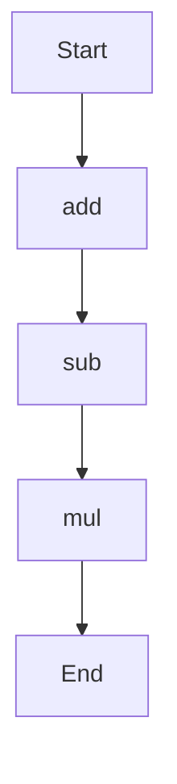

# API Documentation
## calculator.py
### Functions
#### add(a, b)
##### Description
The `add` function calculates the sum of two numbers.
##### Parameters
* `a` (int or float): The first number to add.
* `b` (int or float): The second number to add.
##### Returns
The sum of `a` and `b`.
##### Example
```python
result = add(5, 7)
print(result)  # Outputs: 12
```

#### sub(c, d)
##### Description
The `sub` function calculates the difference between two numbers.
##### Parameters
* `c` (int or float): The first number.
* `d` (int or float): The second number to subtract from the first.
##### Returns
The difference between `c` and `d`.
##### Example
```python
result = sub(10, 4)
print(result)  # Outputs: 6
```

#### mul(a, b)
##### Description
The `mul` function calculates the product of two numbers.
##### Parameters
* `a` (int or float): The first number to multiply.
* `b` (int or float): The second number to multiply.
##### Returns
The product of `a` and `b`.
##### Example
```python
result = mul(6, 9)
print(result)  # Outputs: 54
```

### Execution Flow
Since there are multiple functions in this file, the following Mermaid flowchart illustrates a possible execution flow:

```mermaid
flowchart TD
    A[Start] --> B[add]
    B --> C[sub]
    C --> D[mul]
    D --> E[End]
```
Note: The actual execution flow may vary depending on the specific use case and how these functions are called in the code.

### Module-Level Code
When run directly, this script does not execute any specific code, as it only contains function definitions. To use these functions, you would need to call them from another script or from the Python interpreter.