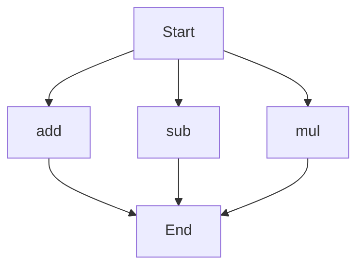

# API Documentation

## calculator.py
The calculator.py file contains a set of functions for performing basic arithmetic operations.

### add(a, b)
#### Description
The `add` function calculates the sum of two numbers.

#### Parameters
* `a` (number): The first number to be added.
* `b` (number): The second number to be added.

#### Returns
* The sum of `a` and `b`.

#### Example
```python
result = add(5, 3)
print(result)  # Output: 8
```

### sub(c, d)
#### Description
The `sub` function calculates the difference between two numbers.

#### Parameters
* `c` (number): The first number.
* `d` (number): The second number to be subtracted from the first.

#### Returns
* The difference between `c` and `d`.

#### Example
```python
result = sub(10, 4)
print(result)  # Output: 6
```

### mul(a, b)
#### Description
The `mul` function calculates the product of two numbers.

#### Parameters
* `a` (number): The first number to be multiplied.
* `b` (number): The second number to be multiplied.

#### Returns
* The product of `a` and `b`.

#### Example
```python
result = mul(7, 2)
print(result)  # Output: 14
```

Since the calculator.py file contains more than one function, the execution flow can be represented as follows:

```mermaid
flowchart TD
    A[Start] --> B[add]
    A --> C[sub]
    A --> D[mul]
    B --> E[End]
    C --> E
    D --> E
```
Note that the execution flow is not strictly sequential, as the functions can be called independently. However, this flowchart illustrates the possible paths of execution when running the calculator.py file directly. 

When run directly, the calculator.py script does not have a main block or any print statements, so it does not perform any specific actions. It is intended to be used as a module, with its functions imported and called by other scripts.