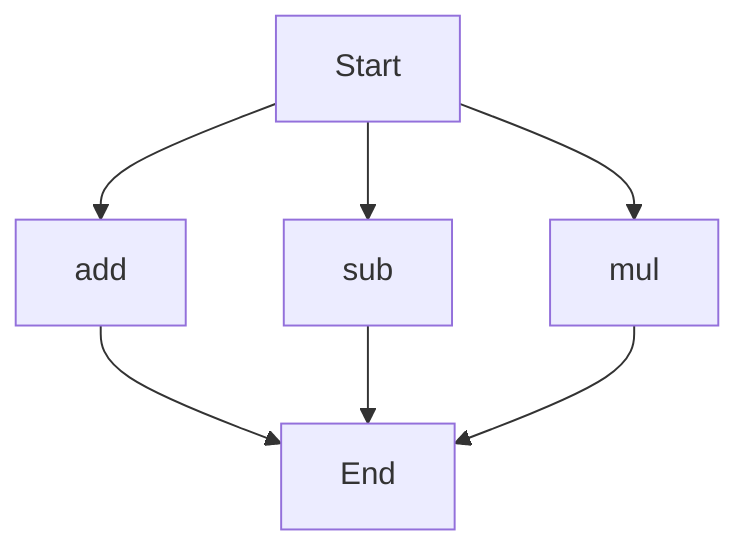

# API Documentation

## calculator.py
### Overview
The `calculator.py` file contains a collection of mathematical functions for basic arithmetic operations.

### Functions
#### add(a, b)
##### Description
The `add` function takes two numbers as input and returns their sum.
##### Parameters
* `a` (int or float): The first number to be added.
* `b` (int or float): The second number to be added.
##### Returns
* `int` or `float`: The sum of `a` and `b`.
##### Example
```python
result = add(5, 3)
print(result)  # Outputs: 8
```

#### sub(c, d)
##### Description
The `sub` function takes two numbers as input and returns their difference.
##### Parameters
* `c` (int or float): The first number.
* `d` (int or float): The second number to be subtracted from the first.
##### Returns
* `int` or `float`: The difference between `c` and `d`.
##### Example
```python
result = sub(10, 4)
print(result)  # Outputs: 6
```

#### mul(a, b)
##### Description
The `mul` function takes two numbers as input and returns their product.
##### Parameters
* `a` (int or float): The first number to be multiplied.
* `b` (int or float): The second number to be multiplied.
##### Returns
* `int` or `float`: The product of `a` and `b`.
##### Example
```python
result = mul(4, 5)
print(result)  # Outputs: 20
```

### Execution Flow
Since there are multiple functions in this file, the following flowchart illustrates the execution flow:

```mermaid
flowchart TD
    A[Start] --> B[add]
    A --> C[sub]
    A --> D[mul]
    B --> E[End]
    C --> E
    D --> E
```
Note: This flowchart represents the possible execution paths for each function in the `calculator.py` file. The actual flow will depend on how the functions are called and used in the program.

### Module-Level Code
When run directly, this script does not execute any specific code. It is designed to be imported as a module and used by other parts of the program.