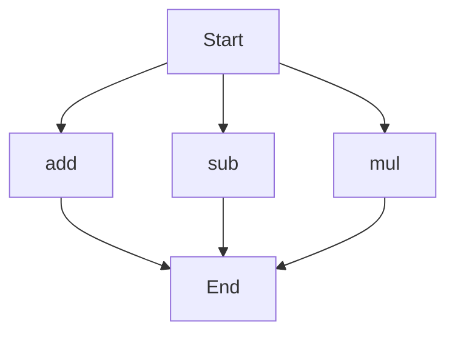

# API Documentation
## calculator.py
The calculator.py file contains a set of mathematical functions for basic arithmetic operations.

### Functions
#### add(a, b)
##### Description
The add function takes two parameters and returns their sum.
##### Parameters
* `a` (int or float): The first number to add.
* `b` (int or float): The second number to add.
##### Returns
The sum of `a` and `b`.
##### Example
```python
result = add(5, 3)
print(result)  # Output: 8
```

#### sub(c, d)
##### Description
The sub function takes two parameters and returns their difference.
##### Parameters
* `c` (int or float): The first number.
* `d` (int or float): The second number to subtract from the first.
##### Returns
The difference between `c` and `d`.
##### Example
```python
result = sub(10, 4)
print(result)  # Output: 6
```

#### mul(a, b)
##### Description
The mul function takes two parameters and returns their product.
##### Parameters
* `a` (int or float): The first number to multiply.
* `b` (int or float): The second number to multiply.
##### Returns
The product of `a` and `b`.
##### Example
```python
result = mul(5, 6)
print(result)  # Output: 30
```

### Execution Flow
Since there are multiple functions in this file, the following flowchart illustrates the execution flow:

```mermaid
   flowchart TD
       A[Start] --> B[add]
       A --> C[sub]
       A --> D[mul]
       B --> E[End]
       C --> E
       D --> E
```
Note: This flowchart assumes that each function can be executed independently, and the actual flow may vary depending on the specific use case.

### Module-Level Code
When run directly, this script does not contain any module-level code, so it does not perform any actions on its own. It is intended to be imported as a module in other scripts to utilize its functions.