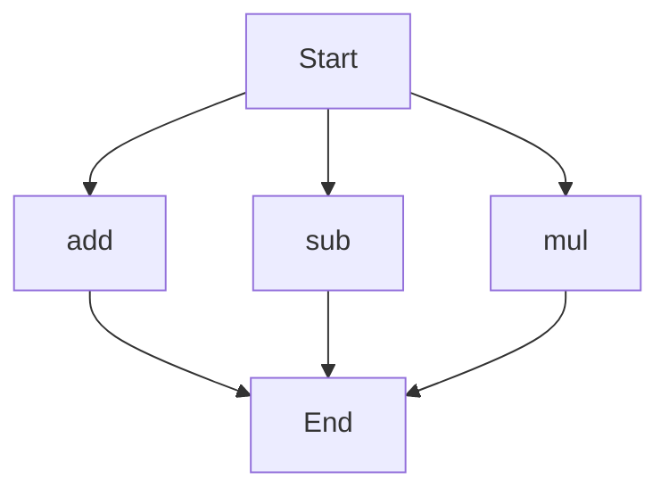

# API Documentation

## calculator.py
The calculator.py file contains a set of mathematical functions to perform basic arithmetic operations.

### add(a, b)
#### Description
The `add` function calculates the sum of two numbers.

#### Parameters
* `a` (int or float): The first number to add.
* `b` (int or float): The second number to add.

#### Returns
The sum of `a` and `b`.

#### Example
```python
result = add(5, 7)
print(result)  # Output: 12
```

### sub(c, d)
#### Description
The `sub` function calculates the difference of two numbers.

#### Parameters
* `c` (int or float): The first number.
* `d` (int or float): The second number to subtract from the first.

#### Returns
The difference of `c` and `d`.

#### Example
```python
result = sub(10, 4)
print(result)  # Output: 6
```

### mul(a, b)
#### Description
The `mul` function calculates the product of two numbers.

#### Parameters
* `a` (int or float): The first number to multiply.
* `b` (int or float): The second number to multiply.

#### Returns
The product of `a` and `b`.

#### Example
```python
result = mul(6, 9)
print(result)  # Output: 54
```

Since there are multiple functions in this file, we will include a flowchart to illustrate the execution flow:

```mermaid
flowchart TD
    A[Start] --> B[add]
    A --> C[sub]
    A --> D[mul]
    B --> E[End]
    C --> E
    D --> E
```
Note: The flowchart shows that the execution can start with any of the three functions, and each function leads to the end of the execution. In a real-world scenario, the execution flow might be more complex, depending on how these functions are used in the program. 

When run directly, this script does not have any specific behavior, as it only contains function definitions. To use these functions, you would need to import this module in another script or call the functions from an interactive Python session.