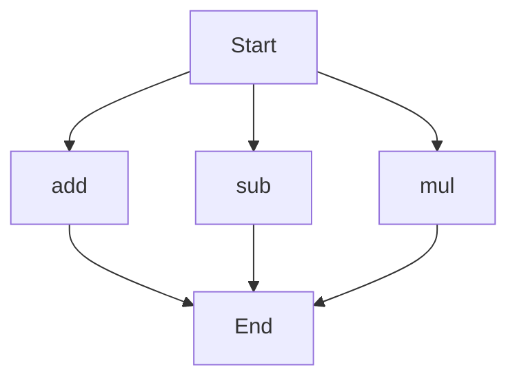

# API Documentation
## calculator.py
The calculator.py file contains a set of mathematical functions for basic arithmetic operations.

### add(a, b)
#### Description
The `add` function takes two numbers as input and returns their sum.
#### Parameters
* `a` (int or float): The first number to be added.
* `b` (int or float): The second number to be added.
#### Returns
* `result` (int or float): The sum of `a` and `b`.
#### Example
```python
result = add(5, 3)
print(result)  # Outputs: 8
```

### sub(c, d)
#### Description
The `sub` function takes two numbers as input and returns their difference.
#### Parameters
* `c` (int or float): The first number.
* `d` (int or float): The second number to be subtracted from `c`.
#### Returns
* `result` (int or float): The difference between `c` and `d`.
#### Example
```python
result = sub(10, 4)
print(result)  # Outputs: 6
```

### mul(a, b)
#### Description
The `mul` function takes two numbers as input and returns their product.
#### Parameters
* `a` (int or float): The first number to be multiplied.
* `b` (int or float): The second number to be multiplied.
#### Returns
* `result` (int or float): The product of `a` and `b`.
#### Example
```python
result = mul(5, 6)
print(result)  # Outputs: 30
```

Since the calculator.py file contains more than one function, the execution flow can be visualized as follows:

```mermaid
flowchart TD
    A[Start] --> B[add]
    A --> C[sub]
    A --> D[mul]
    B --> E[End]
    C --> E
    D --> E
```
This flowchart shows that the script can start with any of the three functions (`add`, `sub`, or `mul`) and will execute the chosen function independently. 

Note: There are no classes or variables defined in the calculator.py file, and no module-level code is present. Therefore, these sections are not included in this documentation.