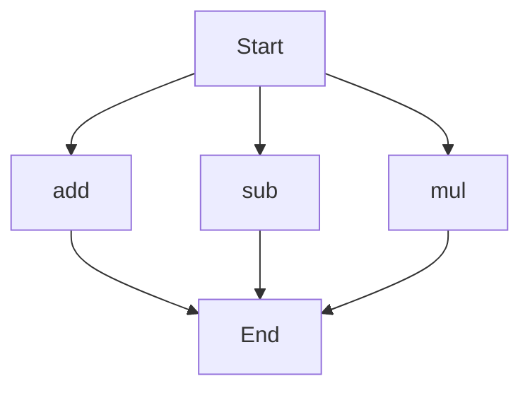

# API Documentation
## calculator.py
The calculator.py file contains a set of functions for basic arithmetic operations. 

### add(a, b)
#### Description
The `add` function takes two numbers as input and returns their sum.

#### Parameters
* `a` (int or float): The first number to add.
* `b` (int or float): The second number to add.

#### Returns
* `result` (int or float): The sum of `a` and `b`.

#### Example
```python
result = add(5, 7)
print(result)  # Outputs: 12
```

### sub(c, d)
#### Description
The `sub` function takes two numbers as input and returns their difference.

#### Parameters
* `c` (int or float): The first number.
* `d` (int or float): The second number to subtract from the first.

#### Returns
* `result` (int or float): The difference between `c` and `d`.

#### Example
```python
result = sub(10, 4)
print(result)  # Outputs: 6
```

### mul(a, b)
#### Description
The `mul` function takes two numbers as input and returns their product.

#### Parameters
* `a` (int or float): The first number to multiply.
* `b` (int or float): The second number to multiply.

#### Returns
* `result` (int or float): The product of `a` and `b`.

#### Example
```python
result = mul(5, 7)
print(result)  # Outputs: 35
```

Since there are multiple functions in this file, the execution flow can be represented as follows:

```mermaid
   flowchart TD
       A[Start] --> B[add]
       A --> C[sub]
       A --> D[mul]
       B --> E[End]
       C --> E
       D --> E
```
This flowchart shows the possible execution paths when using the functions in the calculator.py file. Note that the actual execution flow depends on how these functions are called in the code. 

When run directly, this script does not have any specific functionality beyond providing these arithmetic functions for use in other parts of a program.