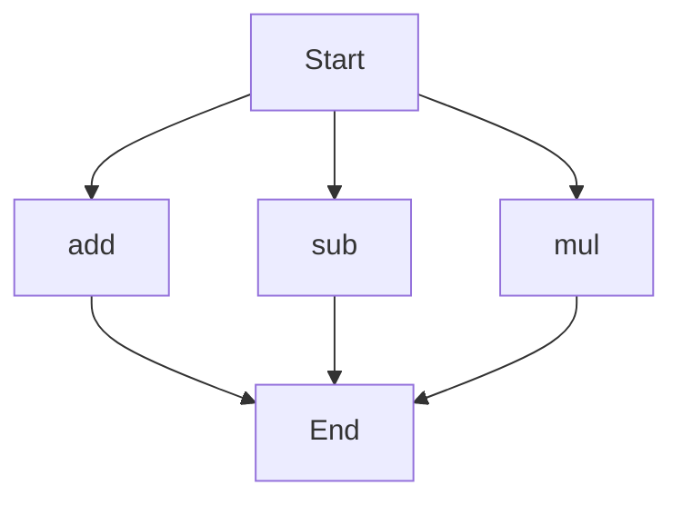

# API Documentation

## calculator.py
The calculator.py file contains a collection of mathematical functions. 

### add(a, b)
#### Description
The `add` function takes two numbers as input and returns their sum.

#### Parameters
* `a` (number): The first number to add.
* `b` (number): The second number to add.

#### Returns
* `result` (number): The sum of `a` and `b`.

#### Example
```python
result = add(5, 7)
print(result)  # Output: 12
```

### sub(c, d)
#### Description
The `sub` function takes two numbers as input and returns their difference.

#### Parameters
* `c` (number): The first number.
* `d` (number): The second number to subtract from the first.

#### Returns
* `result` (number): The difference between `c` and `d`.

#### Example
```python
result = sub(10, 4)
print(result)  # Output: 6
```

### mul(a, b)
#### Description
The `mul` function takes two numbers as input and returns their product.

#### Parameters
* `a` (number): The first number to multiply.
* `b` (number): The second number to multiply.

#### Returns
* `result` (number): The product of `a` and `b`.

#### Example
```python
result = mul(6, 9)
print(result)  # Output: 54
```

Since there are multiple functions in this file, the execution flow can be represented as follows:

```mermaid
   flowchart TD
       A[Start] --> B[add]
       A --> C[sub]
       A --> D[mul]
       B --> E[End]
       C --> E
       D --> E
```
Note that this flowchart illustrates the potential entry points into the calculator functions but does not imply a specific sequence of execution, as the choice of which function to call depends on the user's needs.