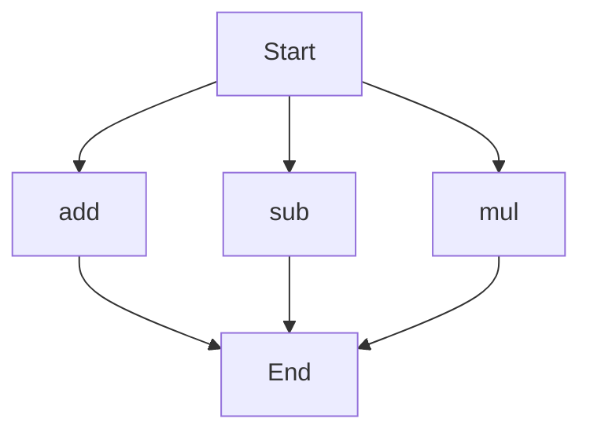

# API Documentation

## calculator.py
### Overview
The `calculator.py` file contains a collection of mathematical functions for basic arithmetic operations.

### Functions
#### add(a, b)
##### Description
The `add` function takes two numbers as input and returns their sum.
##### Parameters
* `a` (number): The first number to add.
* `b` (number): The second number to add.
##### Returns
* `number`: The sum of `a` and `b`.
##### Example
```python
result = add(5, 3)
print(result)  # Output: 8
```

#### sub(c, d)
##### Description
The `sub` function takes two numbers as input and returns their difference.
##### Parameters
* `c` (number): The first number.
* `d` (number): The second number to subtract from the first.
##### Returns
* `number`: The difference between `c` and `d`.
##### Example
```python
result = sub(10, 4)
print(result)  # Output: 6
```

#### mul(a, b)
##### Description
The `mul` function takes two numbers as input and returns their product.
##### Parameters
* `a` (number): The first number to multiply.
* `b` (number): The second number to multiply.
##### Returns
* `number`: The product of `a` and `b`.
##### Example
```python
result = mul(7, 2)
print(result)  # Output: 14
```

### Execution Flow
Since `calculator.py` contains more than one function, the execution flow can be represented as follows:

```mermaid
flowchart TD
    A[Start] --> B[add]
    A --> C[sub]
    A --> D[mul]
    B --> E[End]
    C --> E
    D --> E
```
Note that the execution flow is not strictly sequential, as the functions can be called independently. The flowchart simply illustrates the possible paths of execution. 

### Module-Level Code
When run directly, this script does not execute any specific module-level code, as it is designed to be imported and used as a collection of functions. However, when imported, the functions can be used to perform basic arithmetic operations.