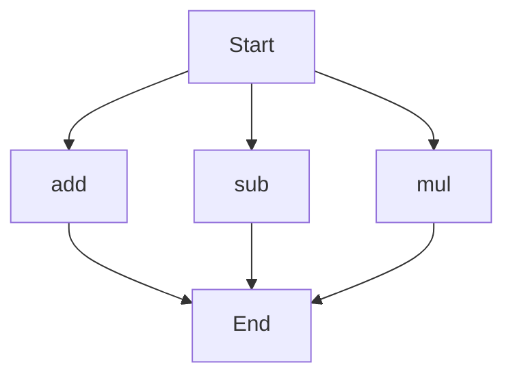

# API Documentation

## calculator.py
### Overview
This module contains a set of basic mathematical functions to perform addition, subtraction, and multiplication.

### Functions

#### add(a, b)
##### Description
This function calculates the sum of two numbers.
##### Parameters
* `a` (int or float): The first number.
* `b` (int or float): The second number.
##### Returns
The sum of `a` and `b`.
##### Example
```python
result = add(5, 3)
print(result)  # Output: 8
```

#### sub(c, d)
##### Description
This function calculates the difference between two numbers.
##### Parameters
* `c` (int or float): The first number.
* `d` (int or float): The second number.
##### Returns
The difference between `c` and `d`.
##### Example
```python
result = sub(10, 4)
print(result)  # Output: 6
```

#### mul(a, b)
##### Description
This function calculates the product of two numbers.
##### Parameters
* `a` (int or float): The first number.
* `b` (int or float): The second number.
##### Returns
The product of `a` and `b`.
##### Example
```python
result = mul(7, 2)
print(result)  # Output: 14
```

### Execution Flow
Since this module contains multiple functions, the execution flow can be represented as follows:

```mermaid
flowchart TD
    A[Start] --> B[add]
    A --> C[sub]
    A --> D[mul]
    B --> E[End]
    C --> E
    D --> E
```
Note: The execution flow is not necessarily linear, as the functions can be called independently. This flowchart is meant to illustrate the possible execution paths. 

### Module-Level Code
This module does not contain any module-level code, such as print statements or main blocks. It is designed to be imported and used as a library of mathematical functions.