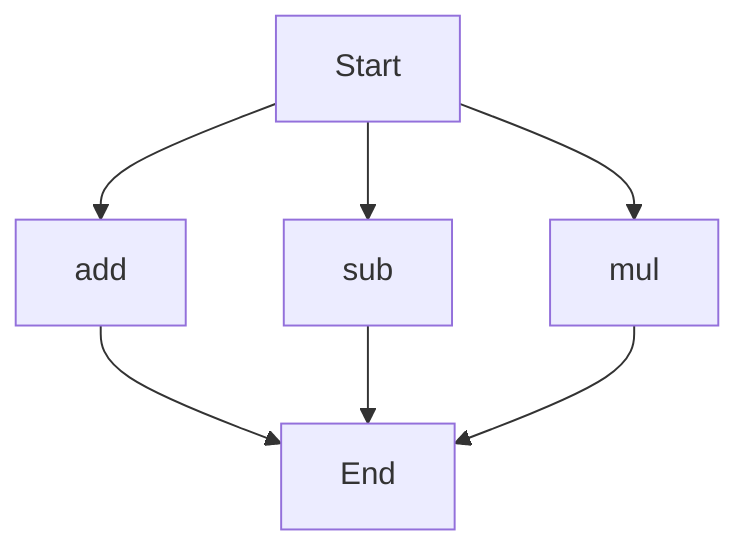

# API Documentation

## calculator.py
### Overview
This module provides basic arithmetic functions for addition, subtraction, and multiplication.

### Functions
#### add(a, b)
##### Description
Performs addition of two numbers.
##### Parameters
* `a` (int or float): The first number to add.
* `b` (int or float): The second number to add.
##### Returns
The sum of `a` and `b`.
##### Example
```python
result = add(5, 3)
print(result)  # Output: 8
```

#### sub(c, d)
##### Description
Performs subtraction of two numbers.
##### Parameters
* `c` (int or float): The first number.
* `d` (int or float): The second number to subtract.
##### Returns
The difference of `c` and `d`.
##### Example
```python
result = sub(10, 4)
print(result)  # Output: 6
```

#### mul(a, b)
##### Description
Performs multiplication of two numbers.
##### Parameters
* `a` (int or float): The first number to multiply.
* `b` (int or float): The second number to multiply.
##### Returns
The product of `a` and `b`.
##### Example
```python
result = mul(5, 6)
print(result)  # Output: 30
```

### Execution Flow

```mermaid
    flowchart TD
        A[Start] --> B[add]
        A --> C[sub]
        A --> D[mul]
        B --> E[End]
        C --> E
        D --> E
```
Note: The execution flow chart shows that the script can start with any of the three functions, and each function will execute independently.