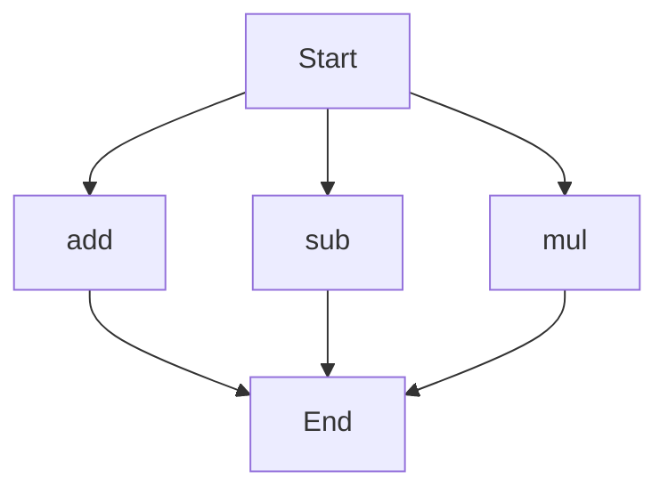

# API Documentation

## calculator.py
### Description
The calculator.py file contains a set of basic arithmetic functions for performing addition, subtraction, and multiplication operations.

### Functions
#### add(a, b)
##### Description
The `add` function takes two numbers as input and returns their sum.
##### Parameters
* `a` (int or float): The first number to add.
* `b` (int or float): The second number to add.
##### Returns
* `int` or `float`: The sum of `a` and `b`.
##### Example
```python
result = add(5, 3)
print(result)  # Output: 8
```

#### sub(c, d)
##### Description
The `sub` function takes two numbers as input and returns their difference.
##### Parameters
* `c` (int or float): The first number.
* `d` (int or float): The second number to subtract from the first.
##### Returns
* `int` or `float`: The difference between `c` and `d`.
##### Example
```python
result = sub(10, 4)
print(result)  # Output: 6
```

#### mul(a, b)
##### Description
The `mul` function takes two numbers as input and returns their product.
##### Parameters
* `a` (int or float): The first number to multiply.
* `b` (int or float): The second number to multiply.
##### Returns
* `int` or `float`: The product of `a` and `b`.
##### Example
```python
result = mul(7, 2)
print(result)  # Output: 14
```

### Execution Flow

```mermaid
flowchart TD
    A[Start] --> B[add]
    A --> C[sub]
    A --> D[mul]
    B --> E[End]
    C --> E
    D --> E
```
Note: The execution flow chart illustrates the possible execution paths for the functions in the calculator.py file. The `Start` node represents the entry point, and the `End` node represents the exit point. The `add`, `sub`, and `mul` nodes represent the respective functions, and the arrows indicate the possible execution flows. 

There are no classes or variables in this file, so no documentation is provided for those. When run directly, this script does not have a main block or any module-level code, so no description is provided for that.