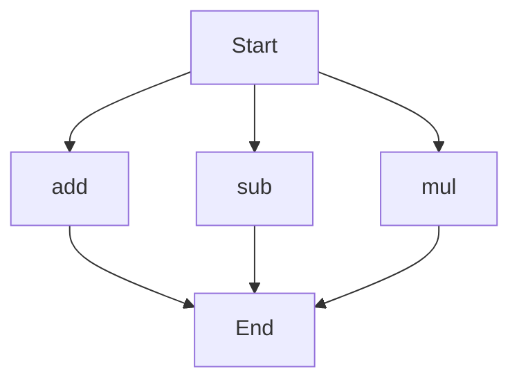

# API Documentation

## calculator.py
This module provides basic mathematical operations.

### Functions
#### add(a, b)
##### Description
This function calculates the sum of two numbers.
##### Parameters
* `a` (number): The first number to add.
* `b` (number): The second number to add.
##### Returns
The sum of `a` and `b`.
##### Example
```python
result = add(5, 7)
print(result)  # Outputs: 12
```

#### sub(c, d)
##### Description
This function calculates the difference between two numbers.
##### Parameters
* `c` (number): The first number.
* `d` (number): The second number to subtract from the first.
##### Returns
The difference between `c` and `d`.
##### Example
```python
result = sub(10, 4)
print(result)  # Outputs: 6
```

#### mul(a, b)
##### Description
This function calculates the product of two numbers.
##### Parameters
* `a` (number): The first number to multiply.
* `b` (number): The second number to multiply.
##### Returns
The product of `a` and `b`.
##### Example
```python
result = mul(6, 9)
print(result)  # Outputs: 54
```

### Execution Flow

```mermaid
flowchart TD
    A[Start] --> B[add]
    A --> C[sub]
    A --> D[mul]
    B --> E[End]
    C --> E
    D --> E
```
This flowchart shows that the module can execute any of the three functions (`add`, `sub`, `mul`) independently, depending on the user's needs. 

Note: Since there are no classes or variables in this module, those sections are omitted. Similarly, there's no description for module-level code as none was provided in the specification.