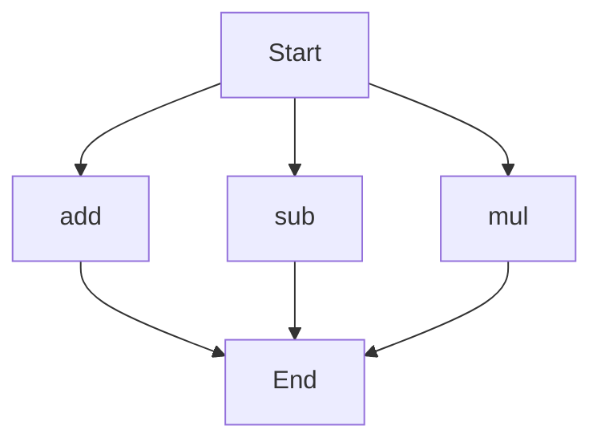

# API Documentation

## calculator.py
The calculator.py module provides a set of basic arithmetic functions.

### Functions
#### add(a, b)
##### Description
The `add` function calculates the sum of two numbers.

##### Parameters
* `a` (int or float): The first number to add.
* `b` (int or float): The second number to add.

##### Returns
* `int` or `float`: The sum of `a` and `b`.

##### Example
```python
result = add(5, 3)
print(result)  # Output: 8
```

#### sub(c, d)
##### Description
The `sub` function calculates the difference of two numbers.

##### Parameters
* `c` (int or float): The first number.
* `d` (int or float): The second number to subtract.

##### Returns
* `int` or `float`: The difference of `c` and `d`.

##### Example
```python
result = sub(10, 4)
print(result)  # Output: 6
```

#### mul(a, b)
##### Description
The `mul` function calculates the product of two numbers.

##### Parameters
* `a` (int or float): The first number to multiply.
* `b` (int or float): The second number to multiply.

##### Returns
* `int` or `float`: The product of `a` and `b`.

##### Example
```python
result = mul(5, 6)
print(result)  # Output: 30
```

### Execution Flow
Since the calculator.py module contains multiple functions, the following flowchart illustrates the execution flow:

```mermaid
flowchart TD
    A[Start] --> B[add]
    A --> C[sub]
    A --> D[mul]
    B --> E[End]
    C --> E
    D --> E
```
Note: This flowchart represents the possible execution paths when using the functions in the calculator.py module. The actual execution flow depends on how the functions are called and used in the application. 

This module does not contain any classes or variables. When run directly, the script does not have a main block, so there is no specific behavior when executed as a standalone script.