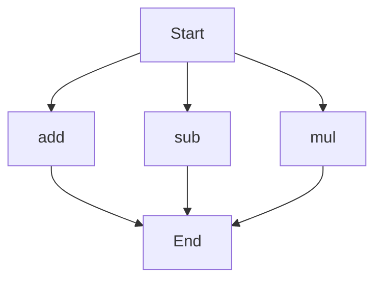

# API Documentation
## calculator.py
### Functions
#### add(a, b)
##### Description
The `add` function calculates the sum of two numbers.

##### Parameters
* `a` (number): The first number to add.
* `b` (number): The second number to add.

##### Returns
The sum of `a` and `b`.

##### Example
```python
result = add(5, 3)
print(result)  # Outputs: 8
```

#### sub(c, d)
##### Description
The `sub` function calculates the difference of two numbers.

##### Parameters
* `c` (number): The first number.
* `d` (number): The second number to subtract from the first.

##### Returns
The difference of `c` and `d`.

##### Example
```python
result = sub(10, 4)
print(result)  # Outputs: 6
```

#### mul(a, b)
##### Description
The `mul` function calculates the product of two numbers.

##### Parameters
* `a` (number): The first number to multiply.
* `b` (number): The second number to multiply.

##### Returns
The product of `a` and `b`.

##### Example
```python
result = mul(5, 6)
print(result)  # Outputs: 30
```

### Execution Flow
Since there are multiple functions in this file, the following flowchart represents the possible execution paths:

```mermaid
flowchart TD
    A[Start] --> B[add]
    A --> C[sub]
    A --> D[mul]
    B --> E[End]
    C --> E
    D --> E
```
Note: This flowchart assumes that the functions can be called independently. The actual execution flow may vary depending on how these functions are used in a larger program.

### Module-Level Code
When run directly, this script does not execute any code outside of the functions, as there are no print statements or main blocks present. The functions are designed to be used in other parts of a program where their calculations are needed.