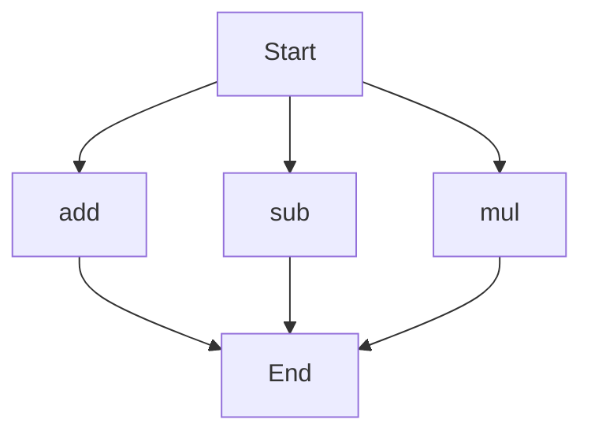

# API Documentation

## calculator.py
The calculator.py file contains a set of mathematical functions that can be used to perform basic arithmetic operations.

### Functions
#### add(a, b)
##### Description
The `add` function takes two numbers as input and returns their sum.

##### Parameters
* `a` (number): The first number to be added.
* `b` (number): The second number to be added.

##### Returns
The sum of `a` and `b`.

##### Example
```python
result = add(5, 3)
print(result)  # Outputs: 8
```

#### sub(c, d)
##### Description
The `sub` function takes two numbers as input and returns their difference.

##### Parameters
* `c` (number): The first number.
* `d` (number): The second number to be subtracted from the first.

##### Returns
The difference between `c` and `d`.

##### Example
```python
result = sub(10, 4)
print(result)  # Outputs: 6
```

#### mul(a, b)
##### Description
The `mul` function takes two numbers as input and returns their product.

##### Parameters
* `a` (number): The first number to be multiplied.
* `b` (number): The second number to be multiplied.

##### Returns
The product of `a` and `b`.

##### Example
```python
result = mul(5, 6)
print(result)  # Outputs: 30
```

### Execution Flow
Since there are multiple functions in this file, the following flowchart illustrates the execution flow:

```mermaid
flowchart TD
    A[Start] --> B[add]
    A --> C[sub]
    A --> D[mul]
    B --> E[End]
    C --> E
    D --> E
```
Note: The execution flow is not necessarily sequential, as the functions can be called independently. This flowchart is meant to provide a visual representation of the available functions and their potential usage.

### Module-Level Code
When run directly, this script does not have any specific module-level code, as it only contains function definitions. To use these functions, you would need to import this module in another script or call the functions directly from within this file.