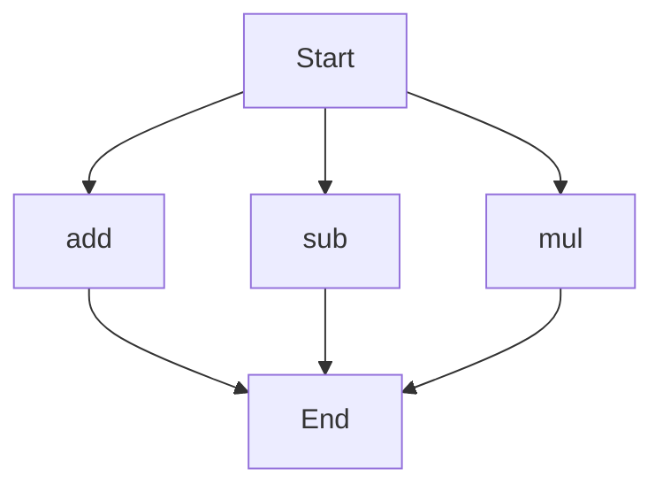

# API Documentation
## calculator.py
### Functions
#### add(a, b)
##### Description
The `add` function calculates the sum of two numbers.

##### Parameters
* `a` (int or float): The first number to add.
* `b` (int or float): The second number to add.

##### Returns
The sum of `a` and `b`.

##### Example
```python
result = add(5, 7)
print(result)  # Output: 12
```

#### sub(c, d)
##### Description
The `sub` function calculates the difference between two numbers.

##### Parameters
* `c` (int or float): The first number.
* `d` (int or float): The second number to subtract.

##### Returns
The difference between `c` and `d`.

##### Example
```python
result = sub(10, 4)
print(result)  # Output: 6
```

#### mul(a, b)
##### Description
The `mul` function calculates the product of two numbers.

##### Parameters
* `a` (int or float): The first number to multiply.
* `b` (int or float): The second number to multiply.

##### Returns
The product of `a` and `b`.

##### Example
```python
result = mul(3, 9)
print(result)  # Output: 27
```

### Execution Flow
Since there are multiple functions in this file, here is a high-level overview of the execution flow:

```mermaid
flowchart TD
    A[Start] --> B[add]
    A --> C[sub]
    A --> D[mul]
    B --> E[End]
    C --> E
    D --> E
```
Note: This flowchart illustrates the possible execution paths for each function, but does not imply a specific order of execution.

### Module-Level Code
When run directly, this script does not have any module-level code, so there is no description to provide. 

Note: This documentation assumes that the functions are defined in the calculator.py file as described, but the actual code is not provided. The examples and descriptions are based on the function names and parameters.