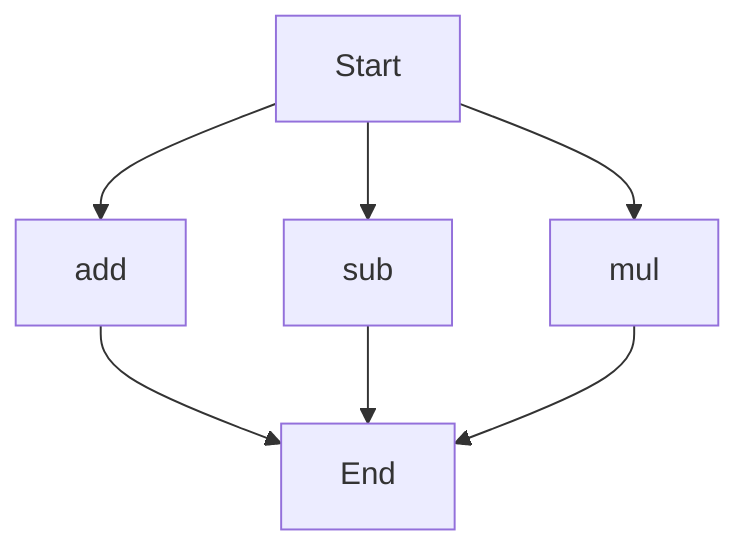

# API Documentation
## calculator.py
### Functions
#### add(a, b)
##### Description
The `add` function calculates the sum of two numbers.
##### Parameters
* `a` (number): The first number to add.
* `b` (number): The second number to add.
##### Returns
The sum of `a` and `b`.
##### Example
```python
result = add(5, 7)
print(result)  # Outputs: 12
```

#### sub(c, d)
##### Description
The `sub` function calculates the difference of two numbers.
##### Parameters
* `c` (number): The first number.
* `d` (number): The second number to subtract from the first.
##### Returns
The difference of `c` and `d`.
##### Example
```python
result = sub(10, 4)
print(result)  # Outputs: 6
```

#### mul(a, b)
##### Description
The `mul` function calculates the product of two numbers.
##### Parameters
* `a` (number): The first number to multiply.
* `b` (number): The second number to multiply.
##### Returns
The product of `a` and `b`.
##### Example
```python
result = mul(3, 9)
print(result)  # Outputs: 27
```

### Execution Flow

```mermaid
flowchart TD
    A[Start] --> B[add]
    A --> C[sub]
    A --> D[mul]
    B --> E[End]
    C --> E
    D --> E
```
Note: This flowchart illustrates the possible execution paths of the functions in the `calculator.py` file. The actual execution flow may vary depending on how the functions are called. 

There are no classes or variables in this file, so those sections are not included in this documentation. When run directly, this script does not have a main block or print statements, so there is no additional description for module-level code.