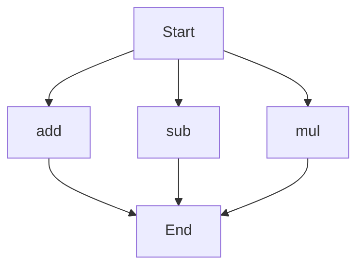

# API Documentation
## calculator.py
The calculator.py file contains a collection of mathematical functions that can be used to perform basic arithmetic operations.

### add(a, b)
#### Description
The `add` function takes two numbers as input and returns their sum.

#### Parameters
* `a` (number): The first number to be added.
* `b` (number): The second number to be added.

#### Returns
* `result` (number): The sum of `a` and `b`.

#### Example
```python
result = add(5, 3)
print(result)  # Output: 8
```

### sub(c, d)
#### Description
The `sub` function takes two numbers as input and returns their difference.

#### Parameters
* `c` (number): The first number.
* `d` (number): The second number to be subtracted from the first.

#### Returns
* `result` (number): The difference between `c` and `d`.

#### Example
```python
result = sub(10, 4)
print(result)  # Output: 6
```

### mul(a, b)
#### Description
The `mul` function takes two numbers as input and returns their product.

#### Parameters
* `a` (number): The first number to be multiplied.
* `b` (number): The second number to be multiplied.

#### Returns
* `result` (number): The product of `a` and `b`.

#### Example
```python
result = mul(7, 2)
print(result)  # Output: 14
```

Since there are multiple functions in this file, here is a flowchart showing the execution flow:

```mermaid
   flowchart TD
       A[Start] --> B[add]
       A --> C[sub]
       A --> D[mul]
       B --> E[End]
       C --> E
       D --> E
```
Note: This flowchart is a simple representation and does not imply any specific order of execution. The functions can be called independently based on the requirements of the program.