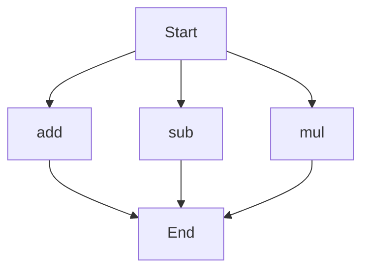

# API Documentation
## calculator.py
### Functions
#### add(a, b)
##### Description
The `add` function takes two parameters, `a` and `b`, and returns their sum. It is a basic arithmetic operation used to calculate the total of two numbers.

##### Parameters
* `a` (int or float): The first number to add.
* `b` (int or float): The second number to add.

##### Returns
* `int` or `float`: The sum of `a` and `b`.

##### Example
```python
result = add(5, 3)
print(result)  # Outputs: 8
```

#### sub(c, d)
##### Description
The `sub` function takes two parameters, `c` and `d`, and returns their difference. It is a basic arithmetic operation used to calculate the difference between two numbers.

##### Parameters
* `c` (int or float): The first number.
* `d` (int or float): The second number to subtract from the first.

##### Returns
* `int` or `float`: The difference between `c` and `d`.

##### Example
```python
result = sub(10, 4)
print(result)  # Outputs: 6
```

#### mul(a, b)
##### Description
The `mul` function takes two parameters, `a` and `b`, and returns their product. It is a basic arithmetic operation used to calculate the product of two numbers.

##### Parameters
* `a` (int or float): The first number to multiply.
* `b` (int or float): The second number to multiply.

##### Returns
* `int` or `float`: The product of `a` and `b`.

##### Example
```python
result = mul(5, 6)
print(result)  # Outputs: 30
```

### Execution Flow
Since there are multiple functions in this file, the following flowchart illustrates the execution flow:

```mermaid
flowchart TD
    A[Start] --> B[add]
    A --> C[sub]
    A --> D[mul]
    B --> E[End]
    C --> E
    D --> E
```
Note: The execution flow is not strictly sequential, as the functions can be called independently. This flowchart is a simplified representation of the possible execution paths. 

### Module-Level Code
When run directly, this script does not have a main block or any module-level code that executes. It is designed to be imported as a module in other scripts, where its functions can be used to perform arithmetic operations.