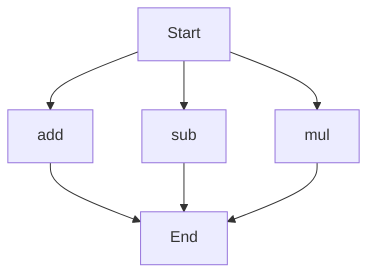

# API Documentation
## calculator.py
### Functions
#### add(a, b)
##### Description
The `add` function takes two parameters and returns their sum. It is used for basic arithmetic addition operations.

##### Parameters
* `a` (int or float): The first number to add.
* `b` (int or float): The second number to add.

##### Returns
* The sum of `a` and `b` (int or float).

##### Example
```python
result = add(5, 7)
print(result)  # Outputs: 12
```

#### sub(c, d)
##### Description
The `sub` function takes two parameters and returns their difference. It is used for basic arithmetic subtraction operations.

##### Parameters
* `c` (int or float): The first number.
* `d` (int or float): The second number to subtract from the first.

##### Returns
* The difference between `c` and `d` (int or float).

##### Example
```python
result = sub(10, 4)
print(result)  # Outputs: 6
```

#### mul(a, b)
##### Description
The `mul` function takes two parameters and returns their product. It is used for basic arithmetic multiplication operations.

##### Parameters
* `a` (int or float): The first number to multiply.
* `b` (int or float): The second number to multiply.

##### Returns
* The product of `a` and `b` (int or float).

##### Example
```python
result = mul(5, 6)
print(result)  # Outputs: 30
```

### Execution Flow
Since there are multiple functions in this file, the execution flow can be represented as follows:

```mermaid
flowchart TD
    A[Start] --> B[add]
    A --> C[sub]
    A --> D[mul]
    B --> E[End]
    C --> E
    D --> E
```
This flowchart illustrates that the script can start with any of the three functions (`add`, `sub`, or `mul`) and will end after executing the chosen function. 

Note: There are no classes or variables in this file, so there is no corresponding documentation for those sections. Similarly, there is no module-level code (like print statements or main blocks) that needs to be documented.