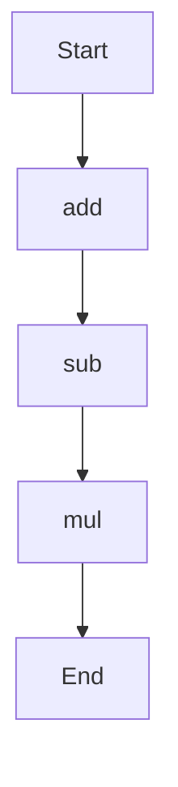

# API Documentation
## calculator.py
The calculator.py file contains a set of basic arithmetic functions.

### add(a, b)
#### Description
The `add` function calculates the sum of two numbers.
#### Parameters
* `a` (number): The first number to add.
* `b` (number): The second number to add.
#### Returns
The sum of `a` and `b`.
#### Example
```python
result = add(5, 3)
print(result)  # Output: 8
```

### sub(c, d)
#### Description
The `sub` function calculates the difference between two numbers.
#### Parameters
* `c` (number): The first number.
* `d` (number): The second number to subtract from the first.
#### Returns
The difference between `c` and `d`.
#### Example
```python
result = sub(10, 4)
print(result)  # Output: 6
```

### mul(a, b)
#### Description
The `mul` function calculates the product of two numbers.
#### Parameters
* `a` (number): The first number to multiply.
* `b` (number): The second number to multiply.
#### Returns
The product of `a` and `b`.
#### Example
```python
result = mul(5, 6)
print(result)  # Output: 30
```

Since there are multiple functions in this file, here is a Mermaid flowchart showing the execution flow:

```mermaid
   flowchart TD
       A[Start] --> B[add]
       B --> C[sub]
       C --> D[mul]
       D --> E[End]
```
Note: This flowchart is a simplified representation and may not reflect the actual execution flow of the script, as the provided code analysis does not include any information about the relationships between the functions or the main execution block. 

This documentation provides a description of each function, including parameters, return values, and usage examples. The flowchart adds a visual representation of the functions and their relationships, making it easier to understand the overall structure of the calculator.py file.